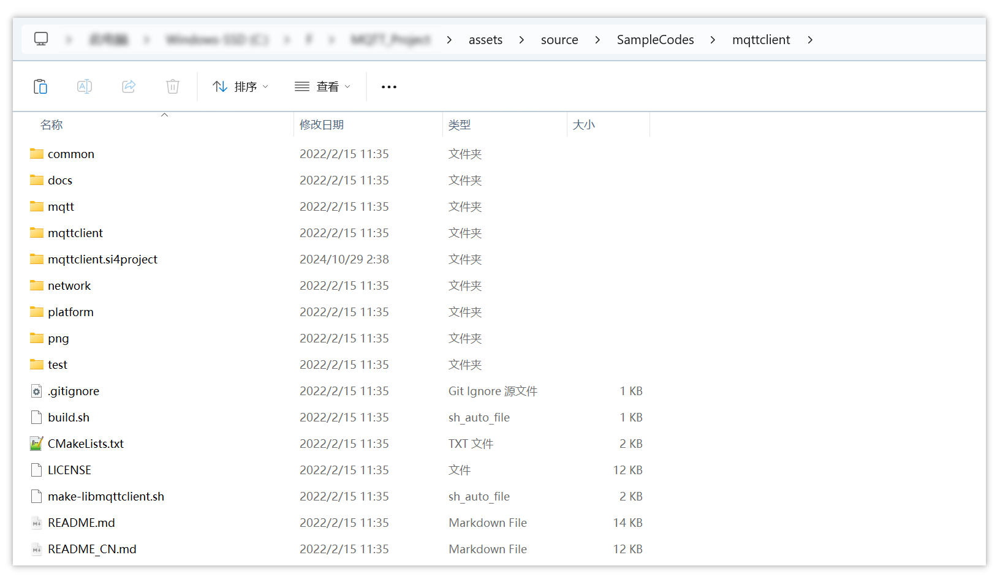
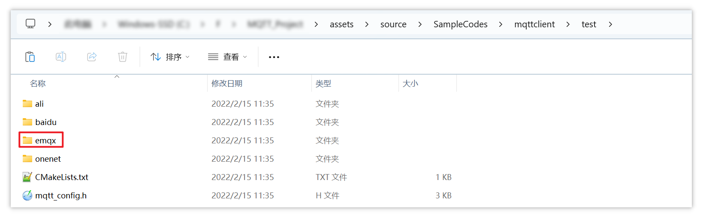

# 源码目录

 [mqttclient](assets/source/SampleCodes/mqttclient) 




mqtt 作者提供了对接不同服务器的客户端测试源码：



本次实验我们使用 emqx 服务器，以下是从 [test.c](assets/source/SampleCodes/mqttclient/test/emqx/test.c) 中的 `main` 函数作为入口对 mqtt 源码进行分析。


# 1.连接服务器

```c
int main(void)
    mqtt_client_t *client = NULL;
    client = mqtt_lease();  
	    c = (mqtt_client_t *)platform_memory_alloc(sizeof(mqtt_client_t));  // 为客户端结构体分配内存
    	memset(c, 0, sizeof(mqtt_client_t));
    mqtt_set_port(client, "1883");              // 连接到服务器的哪个端口
    mqtt_set_host(client, "www.jiejie01.top");  // 连接到哪个服务器
    mqtt_connect(client);                       // 发起连接，创建了一个核心线程 mqtt_yield_thread
		mqtt_connect_with_results(c);
    		rc = network_init(c->mqtt_network, c->mqtt_host, c->mqtt_port, NULL);  // 初始化
    		rc = network_connect(c->mqtt_network);  // 建立 TCP 连接
				nettype_tcp_connect(n);
			    	n->socket = platform_net_socket_connect(n->host, n->port, PLATFORM_NET_PROTO_TCP);  // 需要自己实现此函数
```


# 2.创建线程

```c
int main(void)
    mqtt_connect(client);  // 发起连接，创建了一个核心线程 mqtt_yield_thread
		mqtt_connect_with_results(c);
    		rc = network_init(c->mqtt_network, c->mqtt_host, c->mqtt_port, NULL);
    		rc = network_connect(c->mqtt_network);  // 建立 TCP 连接

            /* send connect packet */
            if ((rc = mqtt_send_packet(c, len, &connect_timer)) != MQTT_SUCCESS_ERROR)
                goto exit;

            if (mqtt_wait_packet(c, CONNACK, &connect_timer) == CONNACK) {
				//...
            }

            /* connect success, and need init mqtt thread */
            c->mqtt_thread= platform_thread_init("mqtt_yield_thread", mqtt_yield_thread, c, MQTT_THREAD_STACK_SIZE, MQTT_THREAD_PRIO, MQTT_THREAD_TICK);
```


# 3.发布消息

```c
int main(void)
    res = pthread_create(&thread1, NULL, mqtt_publish_thread, client);  // 发布线程
	    mqtt_message_t msg;
		memset(&msg, 0, sizeof(msg));
	    msg.payload = (void *) buf;  // 构造要上报的消息

        mqtt_publish(client, "topic1", &msg);
            /* serialize publish packet and send it：构造数据包 */
            len = MQTTSerialize_publish(c->mqtt_write_buf, c->mqtt_write_buf_size, 0, msg->qos, msg->retained, msg->id, topic, (uint8_t*)msg->payload, msg->payloadlen);
			/* 发送数据包 */
            if ((rc = mqtt_send_packet(c, len, &timer)) != MQTT_SUCCESS_ERROR) goto exit;
				len = network_write(c->mqtt_network, &c->mqtt_write_buf[sent], length, platform_timer_remain(timer));
					nettype_tcp_write(n, buf, len, timeout);
						platform_net_socket_write_timeout(n->socket, write_buf, len, timeout);  // 需要自己实现此函数
```


# 4.订阅消息

```c
int main(void)
    mqtt_connect(client);  // 发起连接，创建了一个核心线程 mqtt_yield_thread
		mqtt_connect_with_results(c);
            /* connect success, and need init mqtt thread */
            c->mqtt_thread= platform_thread_init("mqtt_yield_thread", mqtt_yield_thread, c, MQTT_THREAD_STACK_SIZE, MQTT_THREAD_PRIO, MQTT_THREAD_TICK);
				mqtt_yield_thread
                    /* 核心线程 */
                    while (1) {
                        rc = mqtt_yield(c, c->mqtt_cmd_timeout);  // 1.Read Packet，处理 2.保持 alive：发 Ping 给服务器
                            /* mqtt connected, handle mqtt packet */
                            rc = mqtt_packet_handle(c, &timer);  // 处理数据包：读、根据读到的topic调用对应的handle
    							rc = mqtt_read_packet(c, &packet_type, timer);  // 读包，大部分情况下读不到数据 timeout
                        		switch (packet_type) {
                                    case PUBLISH:
                                        rc = mqtt_publish_packet_handle(c, timer);  // 处理收到的 publish 包
								        	mqtt_deliver_message(c, &topic_name, &msg);  // 传输数据：找到与 topic 匹配的 handler 并调用
										    	msg_handler = mqtt_get_msg_handler(c, topic_name);  // 通过遍历链表的方式找到与 topic 匹配的 handle 函数
                                                    /* traverse the msg_handler_list to find the matching message handler */
                                                    LIST_FOR_EACH_SAFE(curr, next, &c->mqtt_msg_handler_list) {
                                                        msg_handler = LIST_ENTRY(curr, message_handlers_t, list);
												msg_handler->handler(c, &md);       /* deliver the message：调用 handle 函数 */
                        if (MQTT_CLEAN_SESSION_ERROR == rc) {     // 3.处理错误                    
```

