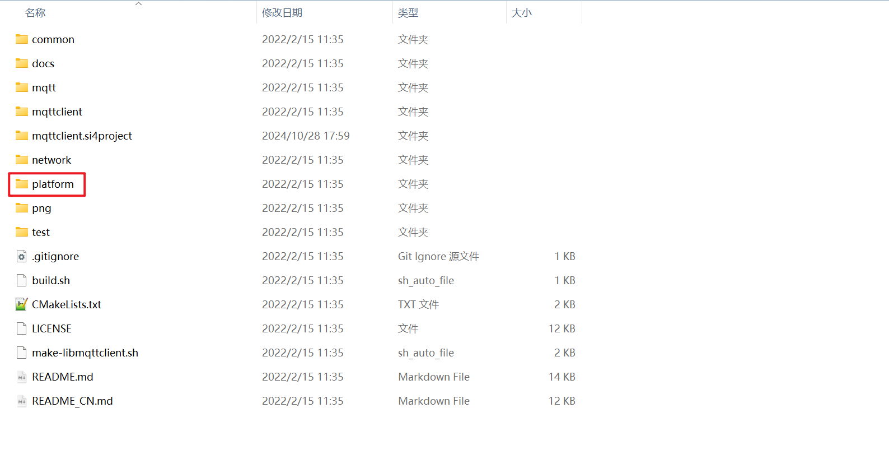
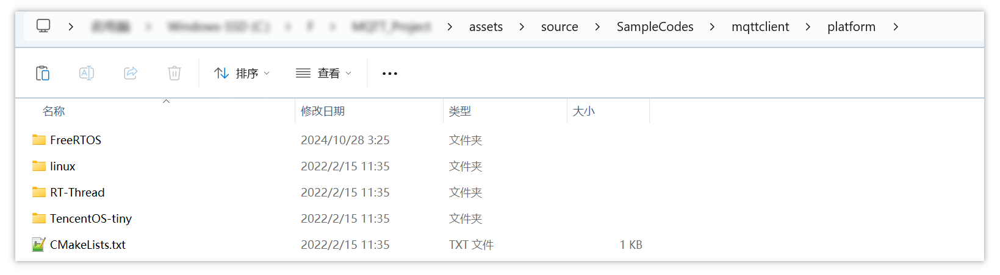
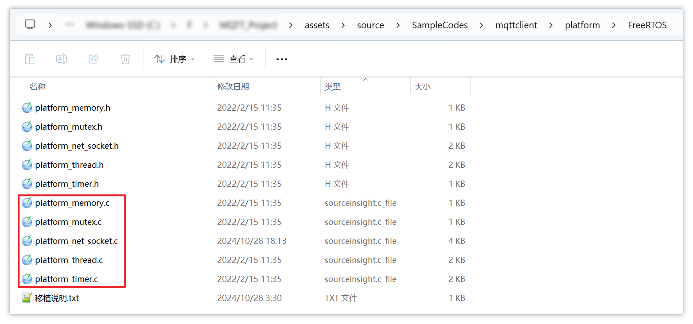

# 1. MQTT源码中需要移植/实现的程序

 [mqttclient源码](assets\source\SampleCodes\mqttclient) 的解压目录中有一个 `platform` 目录：



该目录中提供了不同平台（Linux/RT-Thread/FreeRTOS等）的接口模板：



本次实验使用FreeRTOS平台，这是 mqttclient 作者提供的 FreeRTOS 接口程序：



其中有 4 个文件是作者已经写好实现的：

- platform_memory.c（内存的分配和释放）
- platform_mutex.c（互斥量）
- platform_thread.c（线程）
- platform_timer.c（定时器）

有 1 个文件是需要自己实现的（这也是第 2 天作业）：

-   [platform_net_socket.c](assets\source\SampleCodes\mqttclient\platform\FreeRTOS\platform_net_socket.c) 

对于 [platform_net_socket.c](assets\source\SampleCodes\mqttclient\platform\FreeRTOS\platform_net_socket.c) ，需要实现的主要是 3 个函数：

```c
int platform_net_socket_connect(const char *host, const char *port, int proto)  /* 要自己实现这个函数 */
int platform_net_socket_recv(int fd, void *buf, size_t len, int flags)          /* 读，接收数据 */
int platform_net_socket_write(int fd, void *buf, size_t len)                    /* 写，发送数据 */
```

其中，收、发数据还有另一个函数，可指定超时时间：

```c
int platform_net_socket_recv_timeout(int fd, unsigned char *buf, int len, int timeout)   /* 指定超时时间 */
int platform_net_socket_write_timeout(int fd, unsigned char *buf, int len, int timeout)  /* 指定超时时间 */
```

