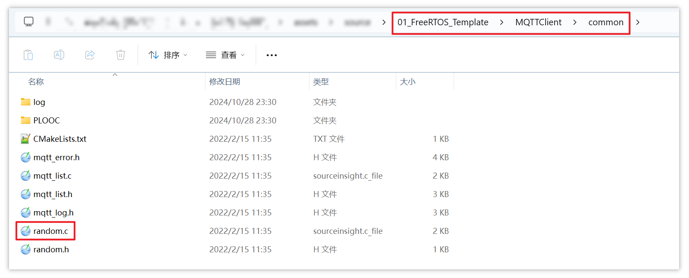
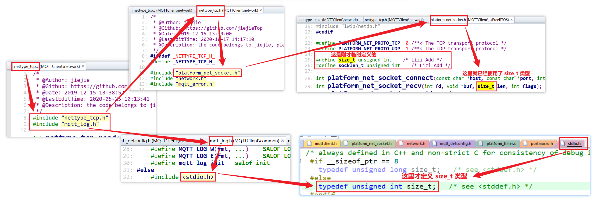
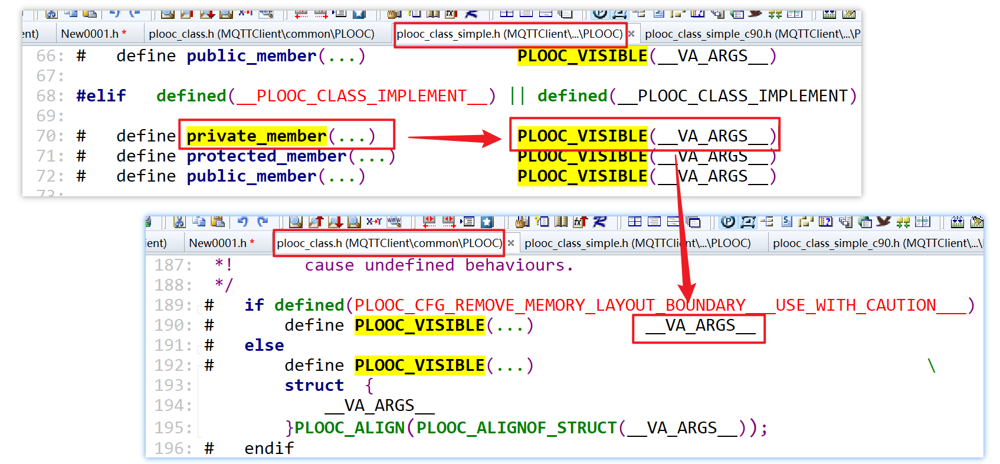

# 1.合并源码


1. 使用 CubeMX 创建一个 FreeRTOS 工程，本项目使用 DShanMCU-F103进行开发，芯片型号为 STM32F103C8T6

   - 配置处理器时钟，选择外部高速时钟源和低速时钟源：

     

   - 本次实验使用 FreeRTOS，FreeRTOS 使用的时基是 Systick，而 STM32CubeMX 中 HAL 库默认使用的时基也是 Systick。为避免可能发生的冲突，将 HAL 库的时基换成其它硬件定时器，如 TIM4。同时 Debug 选择 Serial Wire。

     

   - 配置系统时钟频率，F103 的最高频率为 72MHz

     

   - 配置板载 LED 的 GPIO，将 PC13 设置为 GPIO_Output

     

   - 配置 FreeRTOS，使用 V2 版本的 CMSIS-RTOS API，兼容性更高，便于将来的开发与移植：

     

   - 配置 FreeRTOS 参数：

     

2. 在工程目录下新建一个 `MQTTClient` 目录，用来存放从开源代码 [mqttclient](assets/source/SampleCodes/mqttclient) 中移植过来的文件：

   

3. 在 [mqttclient](assets/source/SampleCodes/mqttclient) 的  [test.c](assets/source/SampleCodes/mqttclient/test/emqx/test.c) 中，`main` 函数用到了以下两个函数：

   

   跳转到它们被定义的文件：

   `mqtt_log_init` 函数在  [common](assets/source/SampleCodes/mqttclient/common) 目录中的  [mqtt_log.h](assets/source/SampleCodes/mqttclient/common/mqtt_log.h) 中被定义

   

   `mqtt_lease` 函数在 [mqttclient](assets/source/SampleCodes/mqttclient) 目录中的  [mqttclient.c](assets/source/SampleCodes/mqttclient/mqttclient.c) 中被定义

   

   因此直接将这两个目录 [common](assets/source/SampleCodes/mqttclient/common) 和 [mqttclient](assets/source/SampleCodes/mqttclient) 拷贝到 FreeRTOS 工程目录下的  MQTTClient 目录：

   

4. 以此类推，继续在 `main` 函数中查看所调用的函数涉及的文件

   函数调用关系（注释列出了函数的定义所在的文件，相同文件不重复列出）：

   ```c
   main
   	mqtt_connect(...)           // "assets\source\mqttclient\mqttclient\mqttclient.c"
   		mqtt_connect_with_results(...)
               network_init(...)	// "assets\source\mqttclient\network\network.c"
       			network_set_ca(...)  
       		network_connect(...)
       			nettype_tls_connect(...)  // "assets\source\mqttclient\network\nettype_tls.c"
       			nettype_tcp_connect(...)  // "assets\source\mqttclient\network\nettype_tcp.c"
       				platform_net_socket_connect(...)  // "assets\source\mqttclient\platform\FreeRTOS\platform_net_socket.c"
   	mqtt_subscribe(...)		
       	mqtt_get_client_state(...)
       	mqtt_get_next_packet_id(...)
       		platform_mutex_lock(...)  // "assets\source\mqttclient\platform\FreeRTOS\platform_mutex.c"
       		platform_mutex_unlock(...)
       	MQTTSerialize_subscribe(...)  // "assets\source\mqttclient\mqtt\MQTTSubscribeClient.c"     
   ```

   在开源代码 [mqttclient](assets/source/SampleCodes/mqttclient) 的目录中，需要拷贝到 FreeRTOS 工程目录下 MQTTClient 目录的所有目录汇总：

   ```
   "assets\source\mqttclient\common"      // 各类通用的头文件
   "assets\source\mqttclient\mqttclient"  // 核心，提供各种发布、订阅函数
   "assets\source\mqttclient\network"     // 网络协议
   "assets\source\mqttclient\platform"    // 平台相关的函数，只保留 FreeRTOS 的
   "assets\source\mqttclient\mqtt"		   // 格式相关的函数
   ```

   

   拷贝完成后，FreeRTOS 工程目录中， MQTTClient 中包含如下子目录：

   

   其中，platform 目录包含多个平台的接口文件，只保留 FreeRTOS 平台接口：

   


# 2.将 mqtt 源码添加进 keil 工程

1. 使用 Keil5 打开工程

   

2. 编译工程，此时工程只有 CubeMX 生成的代码，尚未将合并过来的 mqttclient 源码添加到工程中

   

3. 根据合并过来的源码，在工程中添加相应的组别：

   

4. 将 common 目录下的文件添加到 common 组别（在工程中只需要添加 c 文件）：

   

5. 将 mqtt 目录中的所有文件添加到 mqtt 组别中：

   

6. 将 mqttclient 目录中的 mqttclient.c 添加到 mqttclient 组别中：

   

7. 将 network 目录下加密相关以外的文件添加到 network 组别：

   

8. 将 platform 目录下 FreeRTOS 相关代码添加到 platform 组别：

   


# 3.解决编译错误

1. 重新编译工程，共有 6 个错误，解决第一个（警告后续再处理）

   

   第一个错误：

   

   **解决方法：**

   - 在 source insight 中创建这个 FreeRTOS 工程

   - 使用 source insight 的搜索功能找到该头文件 `platform_timer.h`，定位到其位置

     

     

   - 将该头文件的路径添加到 keil 的 **Include Paths**

     步骤一：

     

     步骤二：

     

   **问题原因：**

   - 对于使用尖括号的头文件：

     编译器会在 keil 自带的某些默认目录中找到它们，也可以在自己指定的目录中找到它们（需要设置）

   - 对于使用双引号的头文件：

     一般来说应该放在**当前目录**（即当前 c 文件所在的目录），这样编译器才能找到它们；

     但是使用 keil 编译工程时，对于使用双引号声明的头文件，keil 编译器也会去 **keil 自带的头文件目录**或**自己指定的目录**中找到它

     

   - 对于本案例，当前 c 文件所在目录为：

     

     而头文件所在目录即不在当前 c 文件所在目录，也不在 keil 默认的头文件目录：

     

2. 重新编译工程，每次都从第一个错误解决：

   与前面的错误类似，找不到头文件，是因为没有将该头文件的路径添加到 keil 工程的 Include Paths

   

   解决方法类似，使用 source insight 找到该头文件的位置：

   

   将路径添加到 keil 的 Include Paths：

   

3. 重新编译工程，解决第一个错误，依然是类似的错误，解决过程省略：

   

4. 重新编译，类似的错误，解决掉：

   

5. 重新编译，也是类似错误，解决：

   

6. 重新编译，类似的错误：

   

   但是这个头文件无法在已经移植过来的源码中找到，目前先将其注释掉：

   

7. 重新编译，类似的错误：

   

   对于这些头文件，如果未定义宏 `MQTT_NETWORK_TYPE_NO_TLS`，就需要将它们包含；如果已经定义了这个宏，则不需要包含这些头文件：

   

   TLS 是加密相关的东西，本次实验不涉及这方面的内容，因此解决方法为：定义这个宏，使得这些头文件不需要被包含

   

8. 重新编译，错误提示期望一个括号：

   

   在 source insight 中找到该文件错误的地方：

   

   跳转到这个宏定义的位置：

   

   猜测可能是 `TickType_t` 这个类型未定义，或者与该类型的定义相关的头文件未包含，不使用这个类型来定义宏，看看能否编译通过：

   

   再次编译已经没有这个错误：

   

   意味着确实是 `TickType_t` 这个类型没有被定义，或者缺少该类型相关的头文件，跳转到该类型被定义的地方：

   

   要使用这个类型，就要包含头文件 `portmacro.h`：

   

   定位到该头文件所在目录，属于 FreeRTOS 的可移植代码：

   

   对于这种头文件，需要手动包含：

   

   然后在 keil 工程中添加该头文件 `portmacro.h` 的所在路径（过程省略）

9. 重新编译，上一步的修改引入了更多的错误，定位到第一个错误，在刚才添加进来的头文件中存在未定义的宏：

   

   在 Source Insight 中跳转到这个宏定义的位置，发现了如下问题：

   - FreeRTOSConfig.h 中使用到了 `TickType_t` 类型，这个类型在 portmacro.h 中被定义，因此在 FreeRTOSConfig.h 中声明包含 portmacro.h
   - portmacro.h 中使用到了某些宏，这些宏又在 FreeRTOSConfig.h 中被定义

   

   **解决方案：**

   - 在上一个错误中，包含了头文件 portmacro.h，使得 `TickType_t` 类型可用，但是引入了更多麻烦的错误
   - 撤回上一个错误中的修改，先粗暴地不使用 `TickType_t` 类型，让工程能编译通过
   - <span style="background:#FFFF00;">但是在后续使用 CubeMX 更新工程代码时，发现此修改会被恢复</span>

10. 重新编译，依然是找不到头文件

   

   但是本次实验不试用 lwip 功能，因此直接取消包含这些头文件即可：

   

11. 重新编译，出现未定义的类型 `size_t`

    

    使用 Source Insight 的搜索功能查找 `size_t` 的定义：

    

    搜索结果太多，一时间找不到这个类型的定义：

    

    为了先让工程能够编译通过，先自己定义这个类型：

    

    重新编译，还有类型未定义：

    

    同样地，先自己添加这个类型的定义：

    

12. 重新编译，错误提示重复定义了这个类型：

    

    既然在 `stdio.h` 中已经定义了 `size_t` 类型，为什么前面的错误又说该类型未定义？

    - 可能是顺序问题：对于 `stdio.h` 的包含，其声明的位置在 `size_t` 的使用位置之后

    注意到该错误是在编译 `nettype_tcp.c` 文件时发生的：

    

    那么有可能是该 `nettype_tcp.c` 中的头文件声明顺序出现问题，经过检查，`nettype_tcp.c` 中头文件的包含层级如下：

    

    经过分析，定义 `size_t` 类型的头文件在使用 `size_t` 类型的头文件之后被包含。

    因此解决方法就是调换这两个头文件的声明顺序：

    

    同时要将前两次次错误中自己临时定义的类型删除：

    

13. 重新编译，依然是 `size_t` 类型未定义：

    

    定位到 `platform_net_socket.c`：

    

    在前一个错误中已知 `size_t` 类型定义所在的头文件是 `stdio.h`，`stdio.h` 又被 `mqtt_log.h` 包含。

    因此仿照前面的方法，在 `platform_net_socket.c` 中包含 `mqtt_log.h` 即可：

    

14. 再次编译，还是类型未定义，而且还是在编译 `nettype_tcp.c` 时发生的：

    `nettype_tcp.c` 包含的头文件 `platform_net_socket.h` 中使用到的 `socklen_t` 类型未定义

    

    先自己定义一个 `socklen_t` 类型（其实就是前面删除掉了的，前面只解决了 `size_t` 类型的问题，现在又重新定义 `socklen_t`）：

    

    再次编译，这个文件终于编译通过：

    

15. 下一个错误：

    `addrinfo` 结构体类型还没有定义，或者没有头文件定义了这个结构体，而这个函数是后续需要自己编写实现的

    

    使用 SI（Source Insight）来查看，在 SI 中，这种黑色字体的类型，一般就说明该类型还没有定义：

    

    由于这个文件中的所有函数都是需要自己后续实现的，因此现在直接将所有函数写成空函数：

    

16. 再次编译，剩最后一个错误：

    

    使用 SI 找到该头文件，将路径添加到 keil 的 Include Paths 即可，再次编译，出现 GNU 扩展问题：

    


# 4.解决 GUN 扩展问题

1. keil 使用的编译器是 ARMCC，GUN 是另一种编译器，keil 不支持这种语法：

   

   可以通过 keil 的设置添加 GNU 支持：

   

   这样编译就能通过：

   

2. 学习如何在不添加 GNU 支持的情况下解决这个问题，将 GNU 支持取消勾选并重新编译，手动解决这个问题，并了解为什么会出现这种语法错误

3. 在 SI 中定位到这个错误：

   

   跳转到 `def_class` 这个宏的定义，发现 `def_class` 这个宏的定义有不同的分支：

   

4. 如何确定是哪一个分支？

   - 可以任意进入一个分支，故意引入错误，然后重新编译看看有没有影响
   - 如果没有影响，说明 `def_class` 不是使用这个文件中的定义

5. 进入第一个文件 `plooc_class_simple_c90.h`，故意引入一个错误：

   

   然后编译：

   

   编译结果并没有发生变化，说明 `def_class` 的定义走的不是这个分支（记得将故意引入的错误删除掉）

6. 进入第二个文件 `plooc_class_simple.h`，如法炮制：

   

   重新编译：

   

   明显多出了一些错误，说明 `def_class` 使用的是 `plooc_class_simple.h` 中的定义（记得将故意引入的错误删除掉）

7. 逐层展开这个宏的定义：

   第一层：

   ```c
   #define def_class(__name, ...)          __def_class(__name, __VA_ARGS__)                   
   ```

   第二层：

   ```c
   #define __def_class(__name, ...)                                                \
       typedef struct __name __name;                                               \
       struct __name {                                                             \
           __VA_ARGS__                                                             \
       };   
   ```

   也就是：

   

   那么对 `def_class` 的展开过程就是：

   

   那么先在原文中替换为展开后的样子，看看是否还有错误：

   

   编译，错误发生在 `private_member` 中，同时注意到，**匿名结构体**仅在 GNU 中受支持：

   

   所谓匿名结构体，就是这样：

   ```c
   struct name {
       int a;
       int b;
       struct {    // 这就是匿名结构体，匿名结构体没有类型名称
           int c;
           int d;
       } name1;    // 这是结构体变量名
   };
   ```

   试着将 `private_member` 删掉，进一步确认错误是否发生在这里面：

   

   编译后错误就消失了，可以确定问题就在 `privat_member` 中，解决这个问题之前先将代码恢复：

   

8. 注意到 `private_member` 也是一个宏，需要展开：

   

   使用 SI 跳转到 `privat_member` 的定义时，会跳转到 `plooc_class_simple_c90.h` 文件中的定义，而实际上这个宏的定义应该和上面的 `def_class` 一样，都是使用 `plooc_class_simple.h` 中的定义（这是个坑）：

   

   在 `plooc_class_simple.h` 中，对最前面的这个分支故意引入错误，看看是否使用了这个分支：

   

   编译结果没有变化，说明这个分支并没有被使用：

   

   那么走的就是这些分支中的其中一个：

   

   依然是采用在要测试分支中故意引入错误的办法来确定使用的是哪一个分支，最终确定在测试这个分支时引入了更多的错误：

   

   展开后又有两个分支：

   

   通过故意引入错误发现它走的是 `else` 分支，也就是说，`private_member` 的宏按以下层次展开：

   

   那么整个展开过程就是：

   

   可以发现展开后有匿名结构体，keil 的设置中如果不勾选 `gnu extensions` （gnu 扩展）选项，是不支持这种语法的。

   在不勾选这个选项的情况下要解决这个问题，让 `private_member` 走 `if` 分支就可以了：

    

   要解决这个问题，添加以下定义即可：

   

   这样 `private_member` 走 `if` 分支的宏定义，展开过程就是：

   

9. 编译通过

   