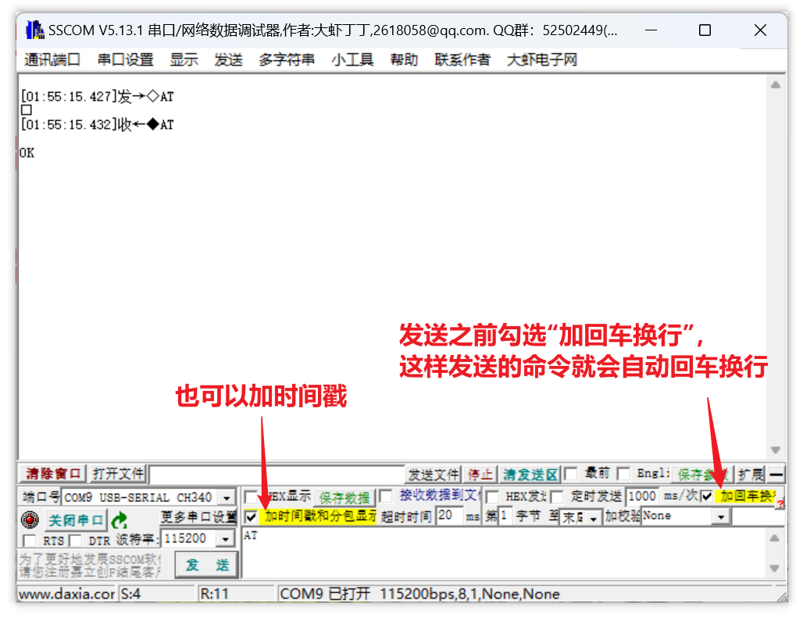
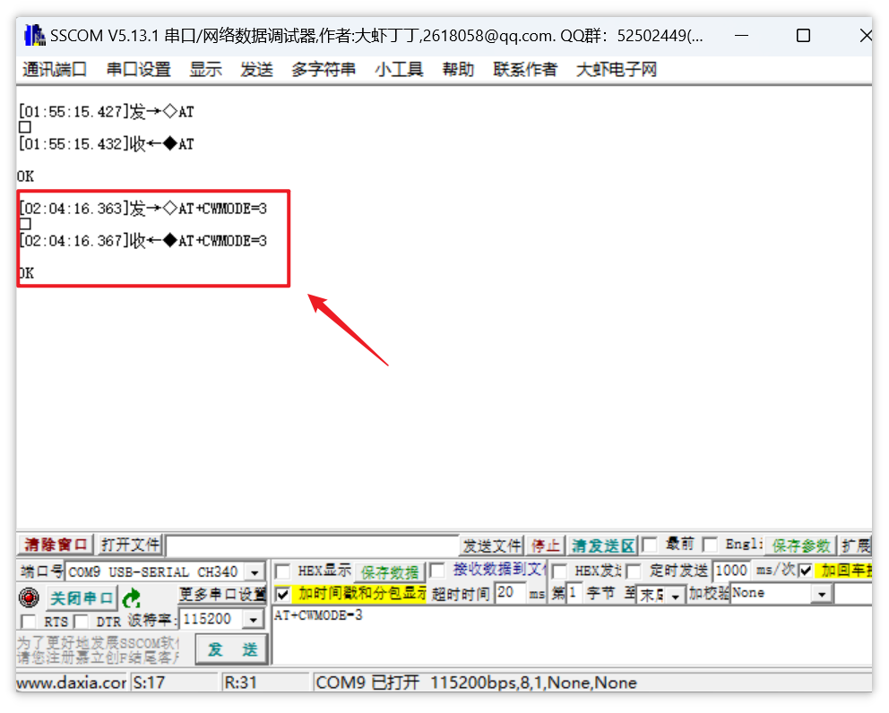
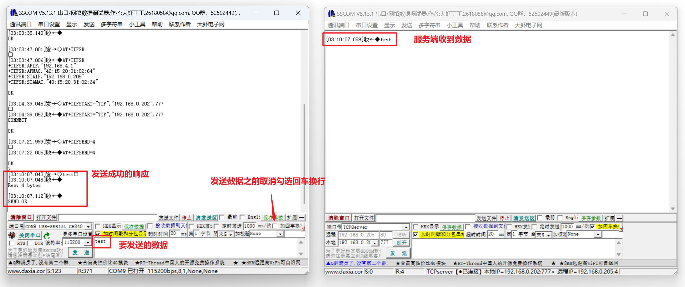

# 1.ESP8266 模块连接图<a id="anchor-01"></a>

## 1.1 接 PC


## 1.2 接单片机 


## 1.3 本次实验连接图


# 2.在 PC 上体验 AT 命令

使用 ESP8266-01S 的固件烧录器来连接，或者按照[ESP8266 模块连接图](#anchor-01)中接 PC 的方式用 **USB TO TTL** 串口来连接。

本次体验使用固件烧录器（简单省事），将 ESP8266-01S 的引脚插入到固件烧录器的引脚插槽，如图：


然后将固件烧录器插入到 PC 的 USB 插口，打开设备管理器，找到刚插入的ESP8266串口：


双击这个串口，进入串口设置页面，将波特率设置为 115200（如果不是 115200，发送 AT 命令将会收不到回复），其它设置如图：


打开串口调试工具（本实验使用 [sscom5.13.1](assets/tools/10_串口网络工具)），选择端口：

 

确认串口设置：


关闭 RTS、DTR，打开串口：


现在这个端口就可以作为客户端使用了，先测试 ESP8266 模块的 AT 命令能否正常使用，发送以下命令：

```
AT
```

发送命令之前要勾选 “加回车换行” 或者手动回车换行再发送，这样 AT 命令才是有效的，如果收到 OK，说明 AT 命令可以正常使用。除此之外还可以勾选 ”加时间戳和分包显示”，效果如图：



如果收不到 OK，可能考虑模块损坏或固件缺失。如果是固件缺失，可以通过烧录 AT 固件解决。

接下来体验使用 AT 命令通过 ESP8266-01S 模块收发数据，与服务端通信。

首先，按以下步骤将 ESP8266 的端口设置为客户端：

1. 配置 ESP8266 端口的 WiFi  模式为 `softAP+station` 模式，发送命令：

   ```
   AT+CWMODE=3  // softAP+station mode
   ```

   正常的返回信息：

   

2. 将 ESP8266-01S 端口连接到路由器，使用以下命令：

   ```
   AT+CWJAP="SSID","password"  // SSID：路由器WiFi名称    password：WiFi密码
   ```

   连接成功如图：

   

3. 查询 ESP8266-01S 设备端口的 IP 地址：

   ```
   AT+CIFSR
   ```

   响应如下：

   

   本次实验中，ESP8266 设备端口作为客户端的 IP 地址为：

   ```
   192.168.0.205
   ```

现在，按以下步骤建立一个服务端：

1. 打开另一个串口调式工具窗口，在通讯端口中选择 TCPServer 就可以作为服务端收发数据：

   

2. 设置服务端的 IP：

   如果客户端的 IP 是 192.168.0.xxx，那么要将服务端的 IP 也设置为 192.168.0.xxx，这样服务端才能接收到客户端的数据。

   

   这样设置好后，只要客户端连接上这个 IP，就能向服务端发送数据。

   但是服务端要向客户端发送数据，还要设置远程 IP 为客户端 IP。

3. 设置侦听客户端：

   如果已经将串口调试工具 SSCOM 的通讯端口设置为服务端，那么是无法修改远程 IP 的（这应该是这个软件的设计缺陷）。

   要修改远程 IP，先在通讯端口中暂时选择为 TCPClient，将远程 IP 修改为 ESP8266-01S 客户端 IP：

   

   再将通讯端口切换回 TCPServer，点击侦听；

   注意切换回 TCPServer 后，本地 IP，即作为服务端的 IP 可能会变动，要改回之前设置的 IP；

   这样服务端既能接收客户端的数据，也能向客户端发送数据：

   

服务端与客户端都设置好后如图：


将 ESP8266 端口作为 TCPClient（TCP客户端）连接到服务端，命令如下：

```
AT+CIPSTART="TCP","192.168.0.202",777  // 服务端 IP 与端口号
```

连接成功，响应为：


向服务端发送数据，需要两步：

1. 发送命令：

   ```
   AT+CIPSEND=4  // 4 表示要发送 4 字节的数据，可以更改
   ```

   响应如下：

   

2. 发送数据，记得取消勾选 “加回车换行”：

   ```
   test
   ```

   响应如下：

   

服务端向客户端发送数据只需要直接发送，不需要指定数据长度：

```
test
```

响应如下，体验结束：


总结本次实验从客户端发送的命令以及接收到的响应：

```
[02:40:13.387]发→◇AT    // 发送：测试 AT 命令能否正常使用
□
[02:40:13.392]收←◆AT    

OK                      // 响应结束

[02:40:24.064]发→◇AT+CWMODE=3    // 发送：配置 ESP8266 端口的 WiFi  模式为 softAP+station
□
[02:40:24.067]收←◆AT+CWMODE=3    

OK                               // 响应结束

[02:41:03.611]发→◇AT+CWJAP="Tenda_A811A0","Password"  // 发送：将 ESP8266-01S 端口连接到路由器，第一个字符串是 WiFi 名，第二个字符串是密码
□
[02:41:03.618]收←◆AT+CWJAP="Tenda_A811A0","Password"  
WIFI DISCONNECT                                       

[02:41:05.799]收←◆WIFI CONNECTED                      

[02:41:14.772]收←◆WIFI GOT IP                         

[02:41:16.621]收←◆                                    
OK                                                     // 响应结束

[02:41:37.421]发→◇AT+CIFSR                             // 发送：查询 ESP8266-01S 设备端口的 IP 地址
□
[02:41:37.425]收←◆AT+CIFSR
+CIFSR:APIP,"192.168.4.1"
+CIFSR:APMAC,"42:f5:20:3f:02:64"
+CIFSR:STAIP,"192.168.0.205"
+CIFSR:STAMAC,"40:f5:20:3f:02:64"

OK                                                     // 响应结束

[02:43:35.537]发→◇AT+CIPSTART="TCP","192.168.0.202",777    // 发送：将 ESP8266 端口作为 TCPClient（TCP客户端）连接到 IP 为 192.168.0.202，端口号为 777 的服务器
□
[02:43:35.543]收←◆AT+CIPSTART="TCP","192.168.0.202",777

[02:43:35.662]收←◆CONNECT

OK                                                         // 响应结束

[02:43:48.843]发→◇AT+CIPSEND=4                             // 发送：要向服务端发送 4 个字节的数据
□
[02:43:48.848]收←◆AT+CIPSEND=4

OK                                                         // 响应结束
> 
[02:43:58.941]发→◇test□                                    // 发送：4 个字节的数据
[02:43:58.946]收←◆
Recv 4 bytes

[02:44:01.898]收←◆
SEND OK                                                    // 响应结束

[02:44:23.738]收←◆
+IPD,6:test                                                // 收到来自服务端主动发送的数据

[02:44:33.085]收←◆CLOSED                                   // 服务端主动断开了与客户端的连接

```


# 3.程序分层


