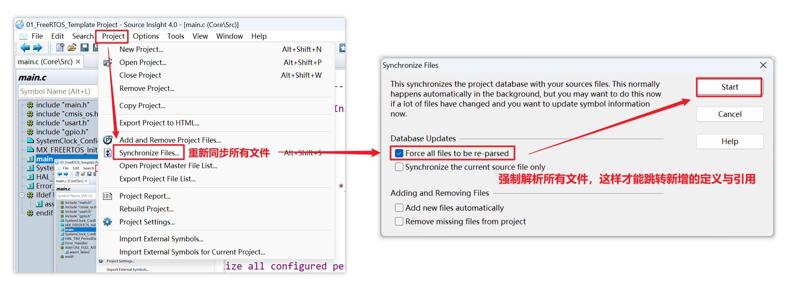
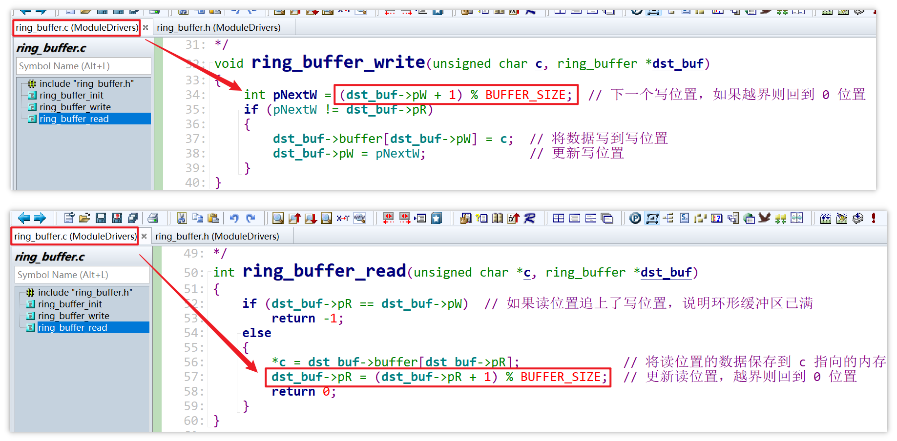
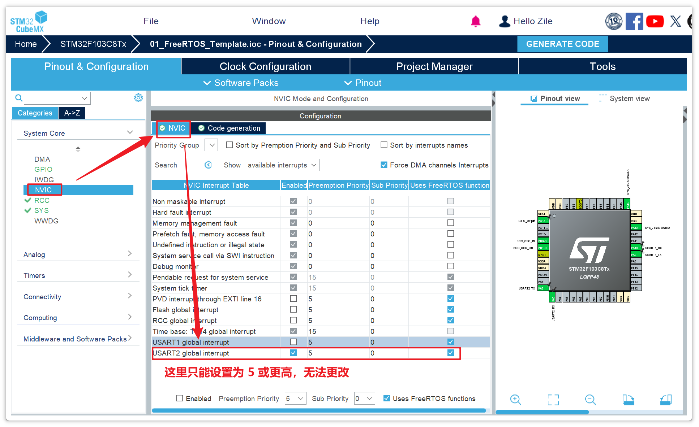
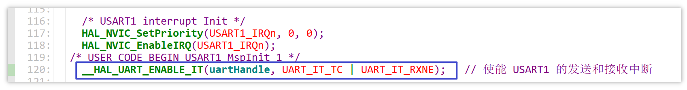

# 1.UART 硬件驱动程序框架

```c
/* UART 硬件相关代码框架 */

// 1.init

// 2.发送数据

// 3.接收数据：由中断触发，使用环形 buffer 保存数据
```


## 1.1 发送数据

对于发送数据，有两种方式：

- 死等：

  - 将缓冲区中的字符逐个发送出去
  - 每发送一个字符，都要等待 UART 将该字符发送出去（查询 UART 某个状态寄存器的 BUSY 位），才发送下一个字符

  ```c
  /* 函数功能：使用死等（查询）方式实现发送数据
   * 输入参数：缓冲区 *buf 中长度为 len 的数据
   */
  UART_Write(char *buf, int len) {
      int i = 0;
      while (i < len) {
          /* 1. 将 buf[i] 的数据写入某个寄存器 Reg */
          
          /* 2. 查询某个状态寄存器的 BUSY 位，若 BUSY 位尚未清 0，则死等
           *    若 BUSY 位为 1，说明数据正在发送中；若 BUSY 位为 0，说明数据发送完成
           */
          while (UART_STATUS & BUSY);
          
          /* 3. 循环退出的趋向 */
          i++;
      }
  }
  ```

- 中断：

  - 将缓冲区 buf 中要发送的数据暂存到另一个缓冲区 xxx_buf
  - 触发一个中断，由中断将 xxx_buf 中暂存的数据逐个发送出去

  ```c
  /* 函数功能：使用中断方式实现发送数据
   * 输入参数：缓冲区 *buf 中长度为 len 的数据
   */
  UART_Write(char *buf, int len) {
      /* 1. buf 有可能是局部变量，将 buf 中的数据拷贝进另一个 xxx_buf */
      Tx_len = len;         // 记录数据长度
      static tx_index = 0;  // 记录发送位置
      memcpy(xxx_buf, buf, len);
      
      /* 2. 核心部分：启动一个 "Tx Empty 中断" */
      
      return;  // 返回并不意味着 buf 中的数据都发送完成
  }
  
  /* 函数功能：Tx_Empty 中断调用函数
   */
  UART_Tx_ISR(...) {
      if (Tx_len != 0) {
          /* 1. 将 xxx_buf 中的某个位置数据转移到变量 c */
          char c = xxx_buf[tx_index++];  // 更新发送位置
          Tx_len--;                      // 更新尚未发送的数据长度
  
          /* 2. 将 c 的数据发送到某个寄存器 Reg*/
  
          return;        
      }
  }
  ```

本次实验将采用死等方式来实现发送数据，比中断方式简单。

关于数据丢失问题：

- 对于死等方式，只是在发送数据的时候死等，此时并不会屏蔽掉接收中断。也就是说，当 UART 触发接收中断时，是会打断发送数据的。

- 由于接收数据是在中断中完成，因此接收的数据不会丢失。

- 而接收中断结束后，回到死等发送，会继续发送上一次没发完的数据，因此发送的数据也不会丢失。


## 1.2 接收数据

对于接收数据，使用环形 buffer：

- 当寄存器中接收到数据时，会触发中断
- 在中断里将寄存器接收到的数据写入环形 buffer
- buffer 中存入的数据由上层代码来读，UART 硬件驱动不关心谁来读，只关心将寄存器收到的数据存起来

```c
/* 函数功能：在中断中接收数据 */
UART_Rx_ISR(...) {
    /* 1. 将寄存器中的数据转移到变量 c */
    
    /* 2. 将 c 中的数据保存到环形 buffer */
}
```

关于环形 buffer 的读与写：

- 初始化一个环形 buffer

  ```c
  char buf[8];  // 定义环形 buffer
  int R = 0;    // 初始化 Read  位置
  int W = 0;    // 初始化 Write 位置
  ```

- 写数据到环形 buffer

  ```c
  buf[W] = val;  // 将 val 写到 Write 位置
  W = W + 1;     // 更新 Write 位置
  if (W == 8)
      W = 0;     // 当 Write 位置越界，让 Write 位置回到 0 位置
  ```

- 从环形 buffer 读数据

  ```c
  val = buf[R];  // 将 Read 位置的数据读到 val
  R = R + 1;     // 更新 Read 位置
  if (R == 8)
      R = 0;     // 当 Read 位置越界，让 Read 位置回到 0 位置
  ```

- 实际读、写数据需要分别判断环形 buffer 空/满了没有

  ```c
  /* 读数据时要考虑环形 buffer 是否空，空了就没有数据可读了 */
  if (R == W)      // 当 Read 位置追上 Write 位置，说明环形 buffer 空了，该读的数据都读完了
      
  /* 写数据时要考虑环形 buffer 是否满，满了就没有位置可写了 */
  int next_W = W + 1;  // 在初始化环形 buffer 时定义这个 next_Write 位置
  if (next_W == 8)
      next_W = 0;      // next_W 位置越界，让 next_W 位置回到 0 位置
  if (next_W == R)     // 这样就满了，实际上 Write 位置和 Read 位置中间空了一个字节，以此区分环形 buffer 空和满的判断条件
  ```

- 怎么理解写数据的环形 buffer 时，buffer 已满的判断条件？

  - 假设 `Read `位置在 `buf[0]`，`Write` 位置来到了 `buf[7]`，则 `next_Write` 位置就回到了 `buf[0]`
  - 此时 `next_Write` 位置追上了 `Read` 位置，这时候就认为环形 buffer 已经写满了，不再往 `Write` 位置也就是 `buf[7]` 写数据

- 添加了判断条件后的写数据：

  ```c
  if (next_W != R) {
      buf[W] = val;    // 将 val 写到 Write 位置
      W = W + 1;       // 更新 Write 位置
      if (W == 8)
          W = 0;       // 当 Write 位置越界，让 Write 位置回到 0 位置  
      next_W = w + 1;
      if (next_W == 8)
          next_W = 0;  // 当 next_Write 位置越界，让 next_Write 位置回到 0 位置
  }
  ```

- 添加了判断条件之后的读数据：

  ```c
  if (R != W) {
      val = buf[R];  // 将 Read 的数据读到 val
      R = R + 1；    // 更新 Read 位置
      if (R == 8)
          R = 0;     // 当 Read 位置越界，让 Read 位置回到 0 位置
  }
  ```

为什么发送数据不用环形 buffer？

- 发送数据使用死等的方式，并不需要用到环形 buffer


# 2.UART 硬件驱动程序编写

## 2.1 USART 硬件结构

### USART 内部框图


### USART 数据收发流程

1. 配置**控制寄存器 1(USART_CR1)**，使能 USART（总开关）、发送器、接收器。

   

2. 配置**波特比率寄存器(USART_BRR)**，设置波特率

   

3. 配置**控制寄存器 1(USART_CR1) **与**控制寄存器 2(USART_CR2)**，设置数据格式：

   - 使用 8个还是 9 个数据位？

   - 是否使用校验位？使用奇校验还是偶校验？

     

   - 使用多少个停止位？

     

4. 配置**控制寄存器 1(USART_CR1)**，使能**发送缓冲区空中断（TXEIE）**、**发送完成中断（TCIE）**、**接收缓冲区非空中断（RXNEIE）**：

   

   使能这些中断的作用：

   - 将一帧数据通过 USART 发送出去时，这一帧的数据会先被推到**发送数据寄存器（TDR）**，再从 **TDR** 被推到**发送移位寄存器（Transmit Shift Register）**，最后由发送移位寄存器负责将这一帧数据一位一位地发送到外部。

     在这个过程中：

     - 当一帧数据刚被推到 **TDR** 时，状态寄存器 USART_SR 的 **TXE** 位为 0，表示还不能发送下一帧的数据；

       当一帧数据从 **TDR** 转移到发送移位寄存器时，USART_SR 的 **TXE** 位将置 1，此时会产生一个 **TXE** 中断，表示 **TDR** 已经空了，可以发送下一帧数据了。但这不意味着这一帧的数据已经被完全发送到外部了。

     - 当发送移位寄存器中一帧数据已经被一位一位地全部发送到外部以后，并且此时 **TDR** 为空，那么 USART_SR 的 **TC** 位将置 1.此时会产生一个 **TC** 中断，表示发送完成。

     

   - 当 USART 接收到外部输入进来的数据时，这个数据会被转移到**接收数据寄存器（RDR）**中，此时状态寄存器 USART_SR 的 **RXNE** 位将置 1，会产生一个 **RXNE** 中断，表示接收到了数据，可以来读数据；读走该数据，**RXNE** 将自动清零。

     

## 2.2 配置 USART 引脚

首先要在工程中配置USART引脚并使能USART，USART1 用来打印调试信息，USART2 用来发送 AT 命令，然后点击右上角的 GENERATE CODE 更新代码：


重新编译工程后，再次出现了之前出现过的错误：


跳转到这个宏定义的地方，会再次出现这个错误是因为每次使用 CubeMX 更新工程代码时，此处宏定义都会恢复为默认的 TickType_t 类型：


现在仍然暂时不处理这个问题，修改为 1000，先编译通过（后续也暂时先这么处理）：


更新完工程代码后，可能会新增一些文件，如果要使用 SI 阅读代码，也要在 SI 上更新工程文件：

1. 先将 FreeRTOS 工程目录下新增的文件添加到 SI 工程：

   

2. 再重新同步并解析所有文件数据：

   

配置好 USART1 和 USART2 后，CubeMX 自动生成了 USART1 和 USART2 的初始化代码：


可以看到 USART 初始化代码中的波特率、数据位、停止位、校验位、流量控制等信息：


 要实现 ESP8266 模块的收发数据，就要使能 USART2 的 NVIC 中断，重新生成代码：


在 USART2 的初始化中，新增了 USART2 的 NVIC 中断优先级，并使能了它的 NVIC 中断：

- 对于 CubeMX 生成的初始化代码中对 NVIC 中断的使能，其仅仅是是能了 USART2 的 NVIC 中断总开关
- 其中的接收中断和发送中断并没有使能，也就是说 CubeMX 只做了最基本的初始化，更深层的中断的使用需要自己管理


由中断向量表定位到 USART2 的中断处理函数，这是 CubeMX 生成的官方中断处理函数：


注释掉官方的中断函数，后续自己实现一个中断处理函数：


但是本次实验在实现的中断处理函数时，仍然会参考官方的中断处理函数中所调用的 `HAL_UART_IRQHandler(&huart2)` 等函数，这些函数位于 `stm32f1xx_hal_uart.c`：


## 2.3 编写环形缓冲区的读写函数

在工程目录下新增 `ModuleDrivers` 目录，在 `ModuleDrivers` 目录下添加 `ring_buffer.c` 与  `ring_buffer.h`，存放环形缓冲区读写函数源码。


如果使用 SI 来编写代码，还要将新增的文件添加到 SI 工程中，并重新同步解析文件（后续不再重复说明该步骤）。

主要实现内容：

1. `ring_buffer.h` 中定义了环形缓冲区的结构体：

   ```c
   #define BUFFER_SIZE  1024    /* 环形缓冲区的大小 */
   
   /* 环形缓冲区结构体 */
   typedef struct
   {
   	unsigned char buffer[BUFFER_SIZE];  /* 环形缓冲区空间 */
   	volatile unsigned int pW;           /* 写位置 */
   	volatile unsigned int pR;           /* 读位置 */
   } ring_buffer;
   ```

2. `ring_buffer.c` 中实现了环形缓冲区的初始化、读、写：

   ```c
   void ring_buffer_init(ring_buffer *dst_buf);  /* 初始化环形缓冲区的读写位置 */
   void ring_buffer_write(unsigned char c, ring_buffer *dst_buf);  /* 将 1 个字节数据写入环形缓冲区 */
   int ring_buffer_read(unsigned char *c, ring_buffer *dst_buf);   /* 将环形缓冲区中 1 个字节的数据读到内存中 */
   ```

值得学习的代码部分：



- 使用了取余操作来表示下一个读、写位置，同时还能处理读、写位置越界的情况，简化了代码

- 与以下代码有异曲同工之效：

  ```c
  /* ring_buffer_write 函数中的 */
  int pNextW = dst_buf->pW + 1;
  if (pNextW == BUFFER_SIZE)
      pNextW = 0;
  
  /* ring_buffer_read 函数中的 */
  dst_buf->pR = dst_buf->pR + 1;
  if (dst_buf->pR == BUFFER_SIZE)
      dst_buf->pR = 0;
  ```

此外 `ring_buffer.h` 中还包含了 `stm32f1xx_hal.h`，这是参考了别人的代码，但尚不清楚有什么作用：


最后，在 keil 工程中新增一个 ModuleDrivers 分组，将 `ring_buffer.c` 添加到该分组，并将 `ring_buffer.h` 所在目录添加到 keil 的 Include Paths：


## 2.4 编写 UART 驱动

定义 UART2 的环形缓冲区（全局变量）：


初始化缓冲区：


使能 UART2 的接收中断：

- 本次实验发送数据使用死等（查询）的方式，不使用中断方式，因此只需要使能 USART2 的 RXNE 中断即可

- 仿照 HAL 库的代码：

  

- 在 `uart.c` 的 USER CODE 中使能 USART2 的接收中断：

  


在 `main.c` 中实现 USART2 的数据接收和发送函数：

- 数据接收在 USART2 的中断处理函数中实现：

  ```c
  void USART2_IRQHandler(void);  /* USART2 的中断处理，如果发生了 RX 中断，则读取接收到的数据 */
  ```

- 数据发送使用死等（查询）的方式实现：

  ```c
  void USART2_Write(char *buf, int len);  /* 使用死等（查询）方式，通过 USART2 将 buf 中长度为 len 的数据发送出去 */
  ```

编译通过，将==当前的工程进度备份到 [01_UART_Driver_Compiled_Successfully](assets/source/01_UART_Driver_Compiled_Successfully) 目录下。==

## 2.5 测试 UART 硬件驱动程序

在 `main.c` 中添加测试，然后进行调试：


期望的实验现象：

- 使用 `USART2_Write` 函数通过 ESP8266 发送 AT 命令后，将会收到 OK 等返回信息

- 当 ESP8266 接收到返回信息时，会调用 USART2 的接收中断，执行中断函数里写环形 buffer 的程序，环形 buffer 的 pW 将会移动

  

  

启动调试，全速运行：


实验结果：没有出现预期现象，环形 buffer 中没有接收到数据，pW 也没有移动。

说明 USART2 的接受中断函数没有被调用，但是由 USART2 的 CR1 控制寄存器可知 RXNEIE 位是 1，确实使能了 USART2 的接收中断。


怀疑是 USART2 的 RXNEIE 中断优先级过低，经过排查，将 USART2 中断的抢占优先级更改为 0，就能得到预期现象（原因未知）。


但这部分配置代码是由 CubeMX 生成的，为了避免后续使用 CubeMX 更新代码时又恢复回去，使用 CubeMX 来更改 USART2 的中断优先级，而不是手动修改此处代码：

1. 打开 CubeMX 找到优先级设置页，发现无法将 USART2 的抢占优先级更改到比 5 小的数

   

2. 经过排查，将 Uses FreeRTOS functions 选项取消勾选，就能够将抢占优先级设置为 0。同时，为了后续可以将调试信息打印到 PC，也使能 USART1 的中断，同样将抢占优先级设置为 0。

   

重新生成工程代码后，USART2 的抢占优先级为 0：


USART1 的抢占优先级也为 0，另外，手动添加对 USART1 的发送和接收中断使能函数（与本次调试实验现象无关，只是为了方便后续使用 USART1 来打印调试信息到 PC）：



重新生成的代码中，CubeMX 会再次在 `stm32f1xx_it.c` 中生成 `USART2_IRQHandler` 中断函数，这会与自己实现的中断函数冲突，像之前那样禁用掉官方的中断函数：


同时，还要重新注释掉：


重新编译，调试通过：


在调试的过程中，有可能出现一使能中断就马上发生一次中断的情况，因此在使能中断之前，先对 USART1 和 USART2 的中断触发位清位：


编译、调试通过，将==当前工程进度保存到 [02_UART_Driver_Debug_Successfully](assets/source/02_UART_Driver_Debug_Successfully) 目录下==。


# 3. 疑难点总结

本次 UART 硬件驱动程序编写实验中主要有以下难点/知识点：

- 使用 UART 协议收、发数据时，需要配置哪些寄存器的哪些位？哪些位可以通过 CubeMX 自动配置生成代码，哪些位需要自己手动写代码配置？

  - 使用 UART 协议实现最基本的收、发数据功能时，需要使能 UART 的总中断，设置 UART 中断优先级

    - 这一步可通过 CubeMX 直接配置生成代码
    - 以 USART1 为例，在 CubeMX 配置 UART1 中断的位置：
      1. 首先需要将对应的引脚配置为 USART1_TX 和 USART1_RX（STM32F103C8T6 的 USART1_TX 为 PA9，USART1_RX 为 PA10，USART2_TX 为 PA2，USART2_RX 为 PA3）
      2. 将 Connectivity --> USART1 --> Mode 设置为 Asynchronous（异步传输），Hardware Flow Control(RS232) 设置为 Disable
      3. 在 System Core --> NVIC --> Configuration --> NVIC 中 将 USART1 global interrupt 的 Enabled 选项勾上，根据需要设置 Preemption Priority（抢占优先级）和 Sub Priority（子优先级）
    - 生成的代码在工程目录下 `/Core/Src/usart.c`

  - 需要设置 UART 的波特率、起始位、数据位、停止位、校验位、流量控制：

    - 这一步通过 CubeMX 直接配置
    - 配置的位置在 Connectivity --> USART1 --> Configuration --> Parameter Settings --> Basic Parameters 中
    - 生成的代码在工程目录下 `/Core/Src/usart.c`

  - 使用中断方式发送数据，则需要使能 UART 的 TXE 中断、TC 中断

    - 这一步需要手动配置，使用 HAL 库函数即可

    - 可以在 `usart.c` 的用户代码中添加：

      ```c
      __HAL_UART_ENABLE_IT(&huart1, UART_IT_TXE | UART_IT_TC);   // HAL 库使能 TXE、TC 中断
      ```

  - 使用中断方式接收数据，则需要手动使能 UART 的 RXNE 中断，参考上述代码

- 使用 HAL 库使能 TXE、TC、RXNE 中断之前，最好先将这些位清 0，避免一使能中断就触发：

  - 这些位在 USART_SR 状态寄存器中，可参考以下代码：

    ```c
    huart1.Instance->SR &= ~(USART_SR_TC | USART_SR_RXNE);  // 清除 UART1 状态寄存器的 TC 和 RXNE 位 
    ```

- 使用环形缓冲区读、写数据时，如何缓冲区空或满的状态？


# 4. 实现的功能总结

1. 实现了环形缓冲区的使用函数：`ring_buffer.c` 

   ```c
   void ring_buffer_init(ring_buffer *dst_buf);
   void ring_buffer_write(unsigned char c, ring_buffer *dst_buf);
   int ring_buffer_read(unsigned char *c, ring_buffer *dst_buf);
   ```

2. 使能了 USART1 的 TC 和 RXNE 中断，USART2 的 RXNE 中断：`usart.c`

   ```c
       /* USART1 interrupt Init */
       HAL_NVIC_SetPriority(USART1_IRQn, 0, 0);
       HAL_NVIC_EnableIRQ(USART1_IRQn);
     /* USER CODE BEGIN USART1_MspInit 1 */
   	uartHandle->Instance->SR &= ~(USART_SR_TC | USART_SR_RXNE);  // 使能前先对 TC 和 RXNE 位清零，避免一使能中断就发生中断
       __HAL_UART_ENABLE_IT(uartHandle, UART_IT_TC | UART_IT_RXNE);   // 使能 USART1 的发送和接收中断
   
       /* USART2 interrupt Init */
       HAL_NVIC_SetPriority(USART2_IRQn, 0, 0);
       HAL_NVIC_EnableIRQ(USART2_IRQn);
     /* USER CODE BEGIN USART2_MspInit 1 */
   	uartHandle->Instance->SR &= ~(USART_SR_RXNE);      // 使能前先对 RXNE 位清零，避免一使能中断就发生中断
   	__HAL_UART_ENABLE_IT(uartHandle, UART_IT_RXNE);    // 使能 USART2 的接收中断
   ```

3. 实现了使用 UART 协议通过 ESP8266 模块发送、接收数据：

   ```c
   void USART2_Write(char *buf, int len);  // 使用死等（查询）方式发送 buf 中长度为 len 的数据（向 UART2 的 DR 寄存器中写数据）
   void USART2_IRQHandler(void);           // 在 UART2 的中断处理函数中，将 ESP8266 接收到的数据读到一个环形 buffer
   ```

   