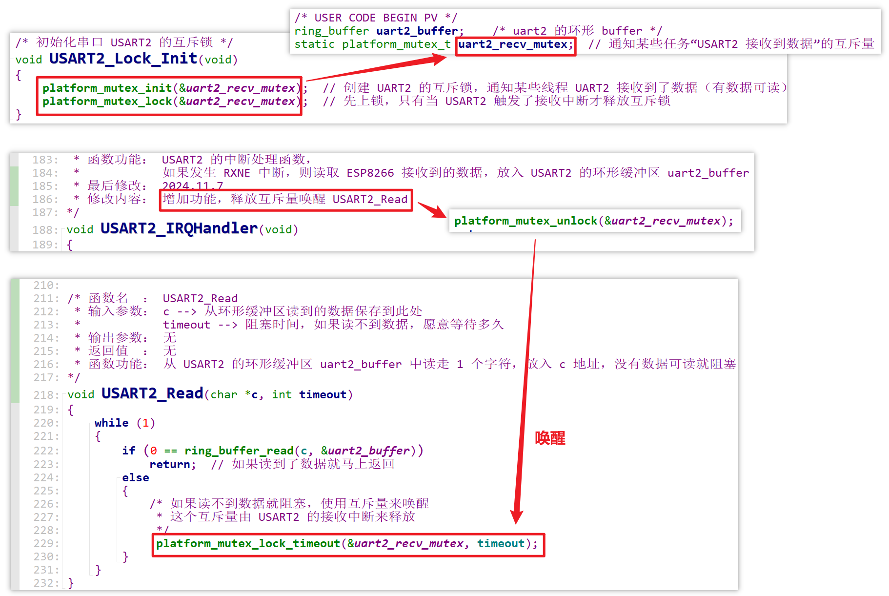
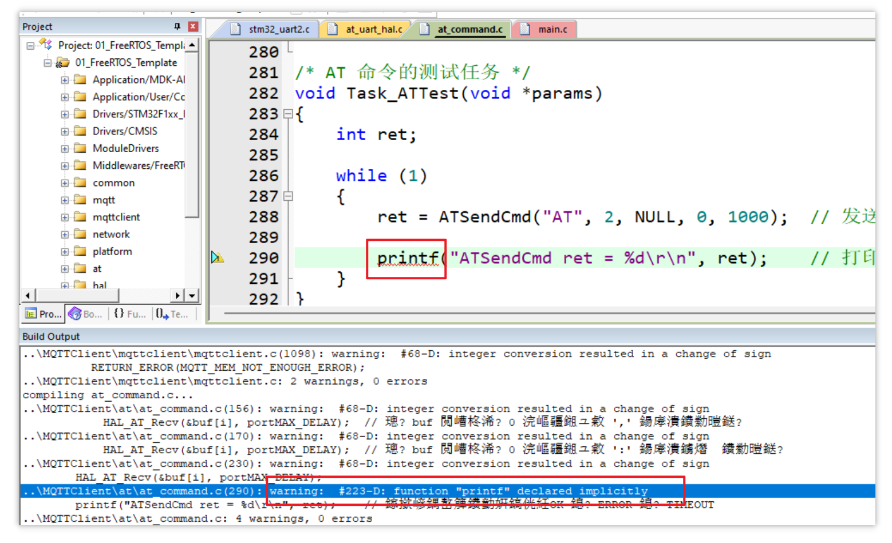
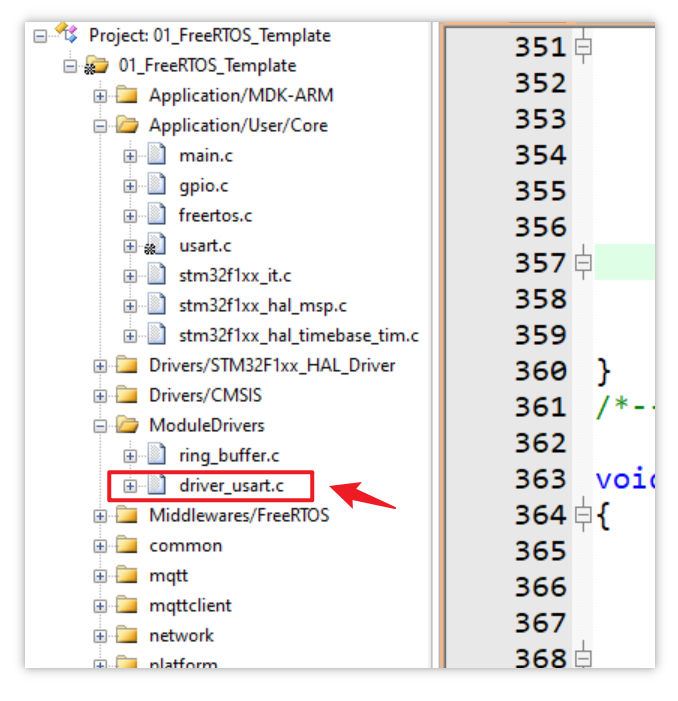
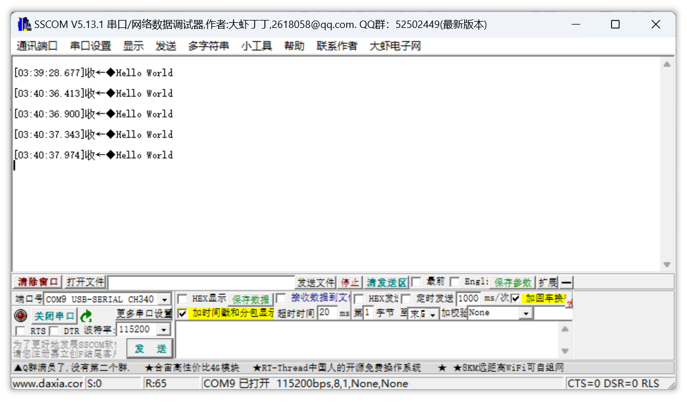
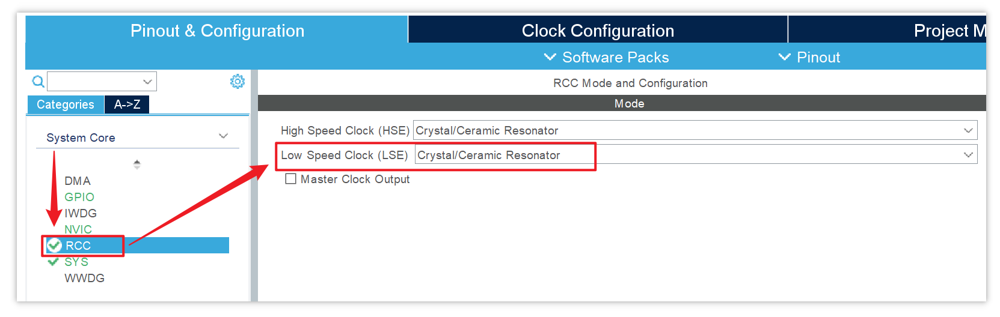

# 1. 参考分析 RT-Thread 的 AT 命令代码

RT-Thread 的 AT 命令参考代码： [rtt_esp8266](assets/source/SampleCodes/rtt_esp8266) 

## 1.1 框架

RT-Thread 发送 AT 命令时，会涉及两个线程。

假设某个 A 线程要调用以下函数发送 AT 命令，通过串口将 AT 命令发送给 ESP8266 模块后，会挂起（阻塞）等待“回应”，这个回应是一个信号量 `client->resp_notice`：


这个信号量由谁释放出来？

会有某个 B 线程循环解析 ESP8266 接收到的数据之后，当读到一行数据后，该线程就会释放信号量给 A 线程：


当 A 获得“回应”（信号量）之后，结束挂起。这样 AT 命令才算发送完成。

## 1.2 数据处理流程

1. 先做特殊处理，如果收到了 urc 对象（特殊数据），就根据 urc_table 表项来调用相应的函数来处理接收到的数据

   

   以收到前缀为 `+IPD` 的数据为例，会调用以下函数做相应处理（不详细展开，只参考框架）：

   

2. 再做一般的数据处理，比如 OK、ERROR 等：

   

## 1.3 线程互斥

RT-Thread 中，调用发送 AT 命令的函数时，里面有一个互斥锁：


有了这个互斥锁，就可以实现“多对一”，即：一个解析线程唤醒多个发送 AT 命令的线程。

- 假设有 A、B 线程都要使用这个函数发送 AT 命令，只有一个 C 线程解析 ESP8266 接收到的数据
- A 先调用了这个函数并且获得了互斥锁，那么 B 调用这个函数的时候只能休眠，直到 A 释放互斥锁
- 这样就可以有不同的线程发送 AT 命令，但同一时间只能有一个线程来发送 AT 命令，因此本质上还是“一对一”


# 2. AT 命令函数编写思路与框架

假设有 A、B 两个线程都会使用一个 AT 命令发送函数来发送 AT 命令，只有一个 C 线程使用解析函数来解析 ESP8266 接收到的 AT 命令返回信息或网络数据包：

1. 对于 A 线程（或 B 线程）：

   - 线程中运行 `AT_Send` 函数，该函数会将 AT 命令发送给 ESP8266，并且与另一个发送 AT 命令的线程互斥
   
   
      - `AT_Send` 函数中：
   
        ```c
        AT_Send (char *buf, int len, int timeout)
        {
            /* 1. 获得互斥量 Mutex（与另外一个需要发送 AT 命令的线程互斥） */
            
            /* 2. 通过 UART2 串口将 AT 命令发送给 ESP8266 模块，由 ESP8266 将数据发送出去 */
            USART2_Write(char *buf, int len);  // UART 硬件驱动程序，使用死等（查询）方式发送 buf 中长度为 len 的数据（向 UART2 的 DR 寄存器中写数据）
            
            /* 3. 阻塞，直到获得“回应”（信号量 Sem）或超时，该信号量由 C 线程解析完接收到的返回信息后释放 */
            BaseType_t xSemaphoreTake( SemaphoreHandle_t xSemaphore, TickType_t xTicksToWait );  // FreeRTOS 获取信号量的函数原型
            
            /* 4. 释放互斥量 Mutex */
        }
        ```
        
      - 需要注意，A 线程（或 B 线程）等待的只是发送 AT 命令后的返回信息，不是网络数据包（如心跳这类“不请自来”的数据）
   
      - 还要注意，该框架中直接调用 `UART2_Write` 函数来发送数据，这么做会将该线程与 UART2 “绑死”，以后要更换平台或增加其它 UART2 设备的话，修改代码会非常麻烦，因此并不是一个好习惯。因此实际编写代码的时候，还要再封装一层代码，而不是直接调用硬件驱动层的程序。
   


2. 再创建一个解析数据线程：

   - 线程中运行 `Uart_Parse` 函数，该函数解析UART2 从 ESP8266 模块接收到的数据

   - `Uart_Parse` 函数中：

     ```c
     Uart_Parse (...)
     {
         while (1)
         {
             /* 1. Read_Uart2 函数：采用休眠唤醒机制读 UART2 串口
              *		1.1. 等待任务通知：
              *          平时处于休眠状态，当 UART2 接收到 ESP8266 的数据时触发接收中断，
              *          硬件驱动程序的 UART2_IRQHandler 中断函数会发送任务通知（后续改造），
              *          该函数接收到任务通知被唤醒
              * 		1.2. 读环形缓冲区：
              *    		UART2_IRQHandler 会将 UART2 从 ESP8266 接收到的数据存入环形缓冲区 uart2_buf，
              *          该函数将 uart2_buf 中的数据暂存到另一个 temp_buf;
              *          注意该函数要读的实际是环形缓冲区 uart2_buf，并非直接读串口，
              *          读串口实际是由 UART2_IRQHandler 函数实现的
              */
            Read_Uart2 (..., forever	); 
             
             /* 2. 解析 temp_buf 中的数据
              *		1.1. 常规解析：
              *           解析 AT 命令的返回信息（如“OK”、“ERROR”），碰到回车换行 "\r\n" 才会一次性解析前面的数据
              * 		1.2. 解析网络数据包，如心跳
              *			a. 解析出的数据放入另一个缓冲区，假设叫做 Data_buf
              * 			b. 唤醒“等待网络数据包”的线程
              *			   可能会有其它线程根据接收到的网络数据来做点灯之类的动作
              */
             
             /*  3. 释放信号量，唤醒等待信号量（回应）的 A 或 B 线程 */
             BaseType_t xSemaphoreGive( SemaphoreHandle_t xSemaphore );  // 释放信号量的 FreeRTOS 函数原型
         }
     }
     ```

   - 需要注意到，大部分时间 ESP8266 模块是没有接收到数据的，因此解析线程平时要处于休眠（挂起）状态，当 ESP8266 接收到了数据时触发 UART2 的接收中断，这时才会发送一个**任务通知**来唤醒解析线程，来达到节省 CPU 资源的目的

3. 改造 UART 硬件驱动程序中的 UART2 接收中断处理函数

   - 关于 UART2 接收中断处理函数所使用的环形缓冲区，这是一个全局数组。过多地使用全局变量不是一个好习惯，但是在本项目中，该环形缓冲区只能由 UART2 接收中断处理函数来写、由 ESP8266 解析数据线程来读（读到之后解析完成，再发送给 “AT 命令发送线程” 或其它“等待网络数据的线程”），因此没有太大关系

     
     
   - 在前面[编写UART硬件驱动程序](./05_编写UART硬件驱动程序.md)时，实现了在 UART2 的接收中断里将 UART2 从 ESP8266 接收到的数据保存在一个环形缓冲区 uart2_buf，现在还要在这个中断里添加一个任务通知来唤醒 C 解析线程 


# 3. 编写 AT 命令发送函数

1. 本次编写实验将在  `MQTTClient` 目录下新增两个目录：

   

   - 一个是 `at` 目录，存放 AT 命令相关函数，在该目录下新增一个 `at_command.c`，在该文件中**实现 AT 命令发送函数**

   - 一个是 `hal` 目录，在该目录中添加不同的硬件接口，**将 AT 命令发送函数与具体的硬件解绑**，这么做是为了提高 AT 命令发送函数的可移植性：

     - 在本项目中，单片机使用 USART2 接口来连接 ESP8266 模块收发数据，如果直接在 `at_command.c` 的 AT 命令发送函数中调用 UART 硬件驱动程序来读写 ESP8266 模块，将来使用其它接口（如 SPI）来连接 ESP8266 模块时，就要将 AT 命令发送函数中调用的 UART 硬件驱动程序改为 SPI 硬件驱动程序，这不是好的开发习惯

     - 正确的做法是在 AT 命令发送函数和硬件驱动程序之间封装一层代码，比如在本项目中，AT 命令发送函数是通过 UART 串口来实现的，那么就在 `hal` 目录下创建一个 `at_uart_hal.c`，实现一个 `HAL_AT_Send` 函数来调用 UART2 的底层硬件驱动程序向 ESP8266 发送数据，AT 命令发送函数应该调用 `HAL_AT_Send` 函数而不是直接调用 `USART2_Write` 函数

       

       同理，如果将来使用 SPI 接口来连接 ESP8266 模块收发数据，则在 `hal` 目录下创建一个 `at_spi_hal.c`，在里面也实现一个 `HAL_AT_Send` 函数来调用 SPI 的底层硬件驱动程序向 ESP8266 发送数据

   -  `main.c` 中暂存[上次实验](./05_编写UART硬件驱动程序.md)编写的底层UART硬件驱动程序：

     - UART 硬件驱动程序其实也不应该直接放在 `main.c` 中，而应该放在专门的驱动程序目录下，之后再修改，暂时不管

   - 代码层级如图：

     

   - 此外，对于互斥量（即信号量）的创建、释放与获取，本次编写实验将会使用从 MQTT 源码移植过来的 `platform_mutex.c`（平台相关的互斥量函数）：

     ```
     工程目录\MQTTClient\platform\FreeRTOS\platform_mutex.c
     ```
     
     - 之所以不直接调用 FreeRTOS 封装好的互斥量函数，是为了增强本次实验代码的可移植性
     - MQTT 源码作者已经为我们封装好了平台相关的互斥量函数，这样我们在 AT 命令发送函数中操作互斥量时，也避免了直接绑死 FreeRTOS 平台的互斥量相关函数
     
     MQTT 源码中与平台相关的函数目录结构如图：
     
     

2. 在 `at_command.c` 中，具体实现的 AT 命令发送函数为：

   ```c
   int ATSendCmd(char *buf, int len, char *resp, int resp_len, int timeout);
   ```

   首先该函数会调用 `at_uart_hal.c` 中的 UART 硬件接口，间接调用 UART2 的底层硬件驱动程序，将一条 AT 命令通过连接到 UART2 的 ESP8266 模块发送出去。

   在 [04_ESP8266驱动程序分层.md](./04_ESP8266驱动程序分层.md) 中体验了使用 PC 连接 ESP8266 发送 AT 命令，可以知道，当发送出去一条 AT 命令，可能会发生以下 3 种情况：

   - ESP8266 成功发送了 AT 命令，并且得到了响应：以 OK 或 ERROR 结尾

     

   - ESP8266 根本没有成功发送 AT 命令，比如硬件损坏、模块未接通、底层驱动程序有 Bug 等情况都有可能导致无法成功发送 AT 命令，那么 ESP8266 根本不会得到响应

   本实验中 AT 命令发送函数希望实现的效果是：

   - 如果 AT 命令成功通过 ESP8266 发送出去并且得到了以 OK 结尾的响应，就将本次响应的所有内容保存到一个 buffer，那么其它程序就可以从 buffer 中读到本次响应的内容，像在 PC 上这样的效果：

     

   - 如果 AT 命令成功通过 ESP8266 发送出去并且得到了以 ERROR 结尾的响应，就返回 ERROR，不需要保存额外的信息

   - 如果尝试通过 ESP8266 发送 AT 命令，但一直没有得到响应，那么该函数就超时返回

   因此，本次实验设置了一个全局的状态变量 `g_at_status`，该状态变量有 3 个取值：

   

   该状态变量取值将由后续实现的解析线程根据得到的响应来设置，解析线程会通过调用一个 `SetATStatus` 函数将该状态变量的取值传递给 AT 命令发送函数：

   

   那么 AT 命令发送函数在发送完 AT 命令后，会阻塞并等待解析线程完成“解析响应的内容、设置响应的状态值、释放一个互斥量”等一系列动作（注意解析线程有可能因为某些原因无法按时解析出数据，又或者 ESP8266 根本没有得到响应而导致解析线程根本没有解析数据，那么解析线程就不会释放互斥量）。

   这样 AT 命令函数后续的动作分支为：

   - 一切顺利，成功得到解析线程释放的互斥量而被唤醒，获取由解析线程设置的 AT 命令的响应状态

     - 如果解析线程将响应状态设置为 `AT_OK`，那么就将解析线程对本次响应解析出来的所有数据保存到一个叫 `resp` 的缓冲区（这些数据将会供其它程序使用），最后返回这个响应状态值

       Ps：在这个分支中，还需要设置一个全局的缓冲区 `g_at_resp`，接收解析线程跨文件传递过来的响应数据，再将 `g_at_resp` 中的数据保存到 `resp` 缓冲区

       

     - 如果解析线程将响应状态设置为 `AT_ERR`，直接返回这个响应状态值

   - 无法按时得到互斥量，因为超时而被唤醒，直接返回响应状态值 `AT_TIMEOUT`（没错，这个响应状态值不是由解析线程设置的）

   那么 AT 命令完整的动作就是：

   


## 3.1 AT 命令发送函数设计细节

1. AT 命令发送函数中，等待 AT 命令返回结果时，为什么实际使用的是互斥量而不是信号量？

   

   - 其实互斥量就是特别的信号量，即取值只有 0 和 1 的信号量（关于互斥量与信号量的详细使用说明可参考[百问网《FreeRTOS入门与工程实践-基于STM32F103》教程-基于DShanMCU-103(STM32F103) | 百问网](https://rtos.100ask.net/zh/FreeRTOS/DShanMCU-F103/)）
     
     
     
     - <span style="background:#FFFF00;">互斥量创建时初始值固定为 1、最大值为 1</span>，信号量创建时可以指定初始值与最大值
     - 当程序**释放**了互斥量或信号量时，互斥量或信号量会 +1；当互斥量或信号量已经为最大值时，无法释放
     - 当程序**获取**了互斥量或信号量时，互斥量或信号量会 -1；当互斥量或信号量已经为最小值时，无法获取
       - 对于互斥量，当程序释放互斥量，互斥量变为 1，其它程序就可以获取互斥量，互斥量又变为 0
     
   - AT 命令发送函数发送了 AT 命令后，等待解析线程解析 ESP8266 返回到串口 UART2 的数据，只有两种情况：
     - 解析成功，释放信号量（需要设置信号量的初始值为 0，最大值为 1），唤醒 AT 命令发送函数，告诉它有返回结果了
     - 解析失败，不释放信号量（信号量仍为 0），不唤醒 AT 命令发送函数，那么 AT 命令发送函数只能超时唤醒
     
   - 因此使用互斥量的效果是一样的：
     - 解析成功，释放互斥量（互斥量被设置为 1），唤醒
     - 解析失败，不释放互斥量（互斥量仍为 0），不唤醒，超时

2. 互斥量的创建与初始化：

   - 本次实验中对互斥量的设计是：AT 命令发送到 ESP8266 后，ESP8266 接收到返回结果，并且解析线程将返回结果解析出来才将互斥量释放出来，唤醒 AT 命令发送线程

   - 由于互斥量创建时的初始值为 1，那么 AT 命令发送线程第一次将命令发送给 ESP8266 时，马上就能得到互斥量，这与本次实验设计相悖，因此**在创建互斥量后，要马上对互斥量上锁**

   

==当前编写进度保存在 [03_AT_Cmd_Send](assets/source/03_AT_Cmd_Send) 目录下。==


# 4. 编写 AT 命令响应的解析函数

1. 创建解析数据任务函数 `ATRecvParser`，在这个函数中做一个死循环，读取 UART2 从 ESP8266 接收到的数据，解析好数据后唤醒 AT 命令发送函数。

   > 注意是创建任务函数，不是创建任务！前面编写的 AT 命令发送函数也是一个任务函数，并不是一个任务。
   >
   > 在 FreeRTOS 里，任务就是线程，本次编写实验只是创建一个解析数据的任务函数，将来再创建一个线程去调用这个任务函数。

   - 参考 FreeRTOS 中使用动态分配内存方式创建任务（线程）的函数：[第9章 任务管理 | 百问网](https://rtos.100ask.net/zh/FreeRTOS/DShanMCU-F103/chapter9.html#_9-2-2-创建任务)

     ```c
     BaseType_t xTaskCreate( TaskFunction_t pxTaskCode, // 函数指针, 任务函数
                             const char * const pcName, // 任务的名字
                             const configSTACK_DEPTH_TYPE usStackDepth, // 栈大小,单位为word,10表示40字节
                             void * const pvParameters, // 调用任务函数时传入的参数
                             UBaseType_t uxPriority,    // 优先级
                             TaskHandle_t * const pxCreatedTask ); // 任务句柄, 以后使用它来操作这个任务
     ```

     使用此函数创建出来的任务（即线程）是 `pxCreatedTask`，该任务具体执行的内容在 `pxTaskCode` 任务函数中。

     注意到第一个参数 `TaskFunction_t pxTaskCode`，`TaskFunction_t` 就是任务函数的类型，对于这个类型，FreeRTOS 是这样定义的：

     ```c
     typedef void (*TaskFunction_t)( void * );
     ```

     也就是说，FreeRTOS 规定了任务函数无返回值，需要传入任意类型的指针。本次实验要编写的解析数据任务函数 `ATRecvParser` 就按照这种类型来创建。

     问题在于：如果 `ATRecvParser` 需要传入多个参数怎么办？

     - 可以定义一个结构体，将所有参数放在结构体里，然后传入这个结构体的指针

     - 反之，如果不需要参数，则传入 `NULL`

2. 任务函数 `ATRecvParser` 的核心是解析 ESP8266 返回来的响应数据以及网络数据，那么首先要解决的就是：如何将 ESP8266 返回来的数据传给 `ATRecvParser` 函数？

   和 AT 命令发送函数一样，`ATRecvParser` 任务函数也不应该直接与 ESP8266 模块交互，这是为了提高任务函数的可移植性。

   因此本次实验也要为 `ATRecvParser` 任务函数和 UART2 硬件驱动程序搭建一座桥梁，也就是一个硬件接口函数。将来使用其它的接口（如 SPI 接口）来连接 ESP8266 模块时，就不需要修改任务函数，而是在硬件接口函数中选择 SPI 的硬件驱动程序。

   那么对于 AT 响应解析的这部分代码，其代码层级就是：

   

   - 首先要实现的是 `USART2_Read` 函数

     大框架是：`USART2_Read` 函数要有一个死循环，不断地尝试读 UART2 的环形缓冲区，但是这么做会有这样的问题：

     > 如果 UART2 的环形缓冲区是空的呢（即 ESP8266 没有返回响应，或者缓冲区里的数据已经被都走了）？难道即使没有数据也要一直读吗？当然不是，大部分时间 UART2 的环形缓冲区都是空的，这样一直在做无用功，会对 CPU 资源造成极大浪费

     这要于 AT 命令发送函数做一个对比：

     - 发送 AT 命令前并不需要等待别人给它通知，只是在发送完 AT 命令后需要阻塞等待解析线程通知它这次的发送有响应，然后被唤醒，才算真正结束一次 AT 命令的发送过程（或者一直没有通知，超时唤醒）。
     - 但接收 AT 响应就不一样了，应该等到 UART2 的环形缓冲区有新的响应数据，才去读（接收）这些响应数据，其它时间应该阻塞等待

     那么 `USART2_Read` 就要引入一个互斥量，由 USART2 的接收中断 `USART2_IRQHandler` 函数释放这个互斥量。这样每当 USART2接口 从 ESP8266 接收到一个字节的数据并存入 USART2 的环形缓冲区时，都会释放互斥量通知并唤醒 `USART2_Read` 函数，让 `USART2_Read` 函数去缓冲区读（接收）走新数据。

     具体操作如下：

     

     目前 USART2 这些硬件驱动代码都暂存在工程的 `main.c` 中，以后再作调整。

     这样解析任务函数只要循环调用 `HAL_AT_Recv` 并指定等待时间就能一个字节一个字节地读到 ESP8266 向 USART2 返回的响应信息了：

     

3. 假设任务函数 `ATRecvParser` 已经读到了 ESP8266 返回来的数据，这些数据应该如何解析的？

   这个问题需要根据数据的类型来做不同的处理：

   - 当数据是以 `OK` 或 `ERROR` 结尾的数据，如下图：

     

     这种数据一般是主动发送 AT 命令后得到的响应，一次有效的响应可能会有多行信息，最终都以 `OK` 或 `ERROR` 结尾。

     在解析这类响应时，每碰到一次 `\r\n`（回车换行）都应该判断一下它的前面是否有 `OK` 或 `ERROR`，如果有就将目前为止接收到的所有信息当作一次响应，并且把这些信息都保存起来，最后返回。

   - 当 ESP8266 返回来的数据是以一些特殊的字符串开头的数据，如下图：

     

     这种数据是与 ESP8266 建立了连接的其它设备端主动发送过来的，也就是 “不请自来” 的网络数据，对于这类数据要特殊处理。

     以上图中使用 ESP8266 连接到 PC 作为客户端为例，服务端主动发送来的数据会有 `+IPD,` 这样的前缀，那么在解析数据的时候也要判断是否有这样子的前缀。
     
     在本部分只编写对第一种响应数据的解析，所以任务函数 `ATRecvParser` 解析数据的框架就是：
     
     >  对于其中涉及到 `strstr` 函数和 `memcpy` 函数的使用方法，可以参考 [知识点杂项.md](./知识点杂项.md) 
     
     

4. 在完善解析任务函数之前，先将测试线程和解析线程创建出来

   先在 `at_command.c` 中创建测试任务函数，测试 AT 命令发送出去后的响应状态：

   

   在 `main.c` 主函数中初始化 AT 命令发送函数和 AT 响应解析函数中涉及的两个互斥锁，并进入 FreeRTOS 的初始化函数中创建 AT 响应解析线程和 AT 命令测试线程：

   

   创建线程时，暂时直接调用 FreeRTOS 的线程函数，后续也要更改为调用 MQTT 源码作者提供的平台接口函数，间接调用 FreeRTOS  的线程函数。

==当前编写进度保存在  [04_AT_Resp_Parser](assets/source/04_AT_Resp_Parser) 目录下。==


# 5. 编写收包函数

实际上 `ATResvParser` 不仅要处理发送 AT 命令得到的响应，还要处理由其它与 ESP8266 建立了连接的设备端向 ESP8266 主动发送的数据，即网络数据包。

接下来将编写解析 `ATResvParser` 任务函数中待实现的收包函数，收包函数将会处理“不请自来”的网络数据包。


首先先修改一处错误：先前创建 `i` 时未给定初始值，应该设为 0，让 buf 从头保存接收到的数据


首先实现 `GetSpecialATString` 函数，判断是否接收到了 `+IPD,` 字符串：


实际网络数据包不只有以 `+IPD,` 为前缀这一种，但本项目暂时只考虑这种数据格式。

如果接收到了 `+IPD,` 字符串，就要调用 `ProcessSpecialATString` 函数来解析网络数据包，并将解析出来的网络数据单独放在一个缓冲区，然后唤醒某个专门读取网络数据包的线程（该线程的任务函数也要实现）。


因此要再添加一个互斥锁 `at_packet_mutex`（AT 网络数据包互斥量），同时为了更好地区分 AT 命令响应和网络数据包相关的线程，将 `at_ret_mutex` 更名为 `at_resp_mutex`（AT 响应互斥量）：


在调用 `ProcessSpecialATString` 函数之前，特殊字符串 `+IPD,` 就已经被接收到了，紧跟着还没接收到的内容是网络数据的长度信息和真正的数据：


因此 `ProcessSpecialATString` 函数的编写思路就是：

- 先将字符串类型的长度信息读出来，解析成整型
- 根据解析出的长度来循环读取真正的网络数据
- 将真正的网络数据存入一个专用的全局 buffer


最后修改 `ATResvParser` 任务函数中的逻辑错误，左图为修改前，右图为修改后：


==当前进度保存在 [05_AT_Process_SpecialString](assets/source/05_AT_Process_SpecialString) 目录下。==


## 5.1 收包函数设计细节

在网络数据包的解析函数中，将 “不请自来” 的网络数据转存起来时，考虑的方案可以有两种：

- 每次接收到这样的网络数据包，解析出有效数据的长度，就临时创建对应长度的缓冲区来存储有效数据，当缓冲区中的数据被取走再释放缓冲区（RT-Thread 的做法）
- 创建一个全局的缓冲区来存储有效数据，但有效数据的长度不能超过缓冲区的容量，如果超过了，则丢弃超过的那部分数据

在 FreeRTOS 中不应该频繁地创建（malloc）和释放（free）缓冲区，这会很容易造成内存碎片，因此宁可丢掉过长的数据，也不使用临时创建缓冲区的做法：


# 6. 调试 AT 命令程序

## 6.1 解决编译错误

1. 编译工程，解决第一个错误：

   

   错误原因是未包含头文件 `at_command.h`，确认在此头文件中声明了涉及的函数，包含即可：

   

   然后将头文件的路径添加到工程的 Include Paths：

   

   重新编译，错误解决。

2. 解决下一个错误：

   

   错误原因是 `main.c` 中用到了互斥量相关的函数，这些函数在 `platform_mutex.h` 中被声明，包含即可：

   

   该头文件的路径在移植 MQTT 源码时已经添加到 Include Paths 了，直接编译通过。

3. 解决下一个错误：

   

   错误原因是 `main.c` 中用到的 AT 命令相关函数未声明，包含头文件 `at_command.h` 即可：

   

   错误仍未解决，经过排查，新增的 `at_command.c` 和 `at_uart_hal.c` 都未添加到工程里，将它们都添加到工程中：

   

   重新编译通过，错误解决。

4. 解决下一个错误：

   

   将 `at_uart_hal.h` 所在目录添加到 Include Paths 即可：

   

   编译通过，错误解决。

5. 解决警告：

   

   出现这个警告是因为 `at_uart_hao.c` 中没有声明外部函数 `USART2_Write`，而 `USART2_Write` 等一系列 USART2 的硬件驱动函数都是在 `main.c` 中实现的，首先要将这些硬件驱动函数迁移到其它地方。

   在 `MQTTClient` 目录下新建一个 `hardware` 目录，在这个路径下创建一个 `stm32_uart2.c` 以及对应的头文件，存放 USART2 相关的硬件驱动程序：

   

   将 `main.c` 中所有与 USART2 硬件驱动函数相关的内容迁移到了 `stm32_uart2.c`，并将 `stm32_uart2.c` 添加到工程中，将 `hardware` 目录添加到 Include Paths：

   

   迁移 uart2 硬件相关驱动函数时要注意头文件的正确包含。

   重新编译通过，警告解决。

6. 解决警告：

   ```
   compiling main.c...
   ../Core/Src/main.c(85): warning:  #223-D: function "AT_Init" declared implicitly
   ```

   原因是 `main.c` 中没有声明 `AT_Init` 函数或包含相关头文件。

   检查 `at_command.h` 中正确声明了需要提供给外部调用的函数，并在 `main.c` 中包含该头文件：

   

   此外，为 `at_command.c` 中不需要暴露给外部的函数添加 `static` 前缀：

   

7. 解决警告：

   

   补充返回值即可：

   

8. 解决警告：

   

   包含头文件 `<string.h>` 即可。

9. 解决警告：

   

   包含头文件 `stdio.h` 即可。

10. 解决警告：

   

   警告原因是 `USART2_Read` 调用 `ring_buffer_read` 时传入的变量 `c` 是 `char*` 类型，而 `ring_buffer_read` 需要的参数类型是 `unsigned char*` 类型：

   

   做类型转换即可：

   

11. 解决警告：

    

    这是 MQTT 源码中 `network.c` 出现的警告，是因为没有包含`string.h`。

    注意到 `network.c` 中包含了 `platform_memory.h`：

    

    `platform_memory.c` 中也使用了 `memset` 函数，也包含了 `platform_memory.h`：

    

    所以直接在 `platform_memory.h` 中包含 `string.h` 即可：

    

12. 解决警告：

    

    这个警告的原因通常是将一个有符号的整型赋值给了无符号的整型，定位到出现警告的地方，结合 `RETURN_ERROR` 和 `MQTT_MEM_NOT_ENOUGH_ERROR` 的定义可知，这里会将一个负值返回给 `mqtt_read_buf_malloc` 函数：

    

    而 `mqtt_read_buf_malloc` 声明的返回类型是 `uint32_t`（无符号的整型），这样做可能会导致该负值被解释为一个数值很大的无符号整型，因此解决方案是将 `mqtt_read_buf_malloc` 函数的返回值类型更改为 `int32_t` 类型（有符号）：

    

13. 解决警告：

    

    解决方法同上一个警告。

14. 解决警告：

    

    警告的原因是 `HAL_AT_Recv` 函数传入的类型为 `int`，而 `portMAX_DELAY` 在 FreeRTOS 中的类型定义为 `TickType_T`：

    

    加上强制类型转换即可：

    

    该文件中还有另外两处同样的警告，一并修改即可。

    最终所有编译的错误和警告都处理完成：

    

    ==当前工程进度保存在 [06_AT_Compiled_Successfully](assets/source/06_AT_Compiled_Successfully) 目录下。==

## 6.2 调试

### 实现 USART1 驱动程序打印调试信息

在调试之前，先实现 USART1 的驱动，让工程中 `printf` 函数打印的内容可以通过串口助手打印到电脑上。

原理可参考此视频：[STM32的printf函数使用讲解【初学必备】](https://www.bilibili.com/video/BV1RV4y1d7Cv/?p=2&spm_id_from=333.788.top_right_bar_window_history.content.click&vd_source=5d9c7e3bfd7a01902b0da55d15722564)

驱动代码可以直接将参考代码 [driver_usart.c](assets/source/SampleCodes/01_FreeRTOS_Template/ModuleDrivers/driver_usart.c) 和 [driver_usart.h](assets/source/SampleCodes/01_FreeRTOS_Template/ModuleDrivers/driver_usart.h) 拷贝到工程目录下的 `ModuleDrivers` 目录：


但是其中部分函数要做取舍，比如下图框选起来的两个 USART 中断使能函数：


参考代码是使用 USART3 来连接 ESP8266 模块的，所以使能了 USART1 和 USART3。

而在本项目中使用的是 USART1 来连接电脑，使用 USART2 来连接 ESP8266，前面已经在工程的 `usart.c` 中的 `HAL_UART_MspInit` 函数里实现了对这两个串口的接收或发送中断使能了：


另外，在 `main` 函数运行到 `MX_USART1_UART_Init` 或 `MX_USART2_UART_Init` 时，就会自动调用 `HAL_UART_MspInit` 函数，执行里面的使能函数：


所以 `driver_usart.c` 提供的两个中断使能函数都可以不要，另外失能 USART1 中断的函数也可以不要：


如果想要失能 USART1 的中断，在 `usart.c` 中的 `HAL_UART_MspDeInit` 函数里添加如下代码即可：


如何区分 `HAL_UART_MspInit` 和 `HAL_UART_MspDeInit` 函数的使用场景？

-  `HAL_UART_MspInit` ：`main` 函数调用 `MX_USART1_UART_Init` 或 `MX_USART2_UART_Init` 函数对 USART 进行初始化时，这两个函数会自动调用 `HAL_UART_MspInit` 
-  `HAL_UART_MspDeInit` ：在不再需要使用 USART 时，用户手动调用该函数失能 USART

此外还要在 `driver_usart.c` 中定义一个 USART1 的测试用环形缓冲区，`fgetc` 函数和 USART1 的中断处理函数都会用到（参考代码是在 `main.c` 中定义该缓冲区的）：


最后检查（一定要包含头文件 `<stdio.h>`）：


记得将 `driver_usart.c` 添加到工程中：



接下来测试 UART1 的串口打印功能，在 `main.c` 中初始化 FreeRTOS 内核之前添加 `printf` 测试用例（否则 `printf` 测试用例不会被执行）：


在编译工程之前，需要打开 `Use MicroLIB`，否则 `fputc` 函数不会被重定向：


打开串口工具，打开 UART1 串口，编译工程并烧录到开发板，串口工具成功打印：


按下复位键可重复打印测试用例：



至此，通过 USART1 驱动向电脑发送打印信息就实现了。

### 调试 AT 相关线程

前面在 `freertos.c` 里已经创建了两个线程：


一个是 ESP8266 返回数据的解析线程，一个是 AT 命令的测试线程。

进入调试模式，全速运行，程序卡死在下图位置：


经过排查，这是由于前面使用 CubeMX 配置 USART1 和 USART2 的中断优先级时，将它们的抢占优先级设置为 0（最高）了，而且还在 USART2 的中断处理函数中调用了 FreeRTOS 中释放互斥量的函数。

> 而在 Cortex-M3 中，在最高的某个中断优先级区间内调用 FreeRTOS 的 API 函数是不被允许的（这被认为是不安全的）。
>
> 这也是为什么先前在 CubeMX 中设置 USART 的中断优先级时，如果勾选了 “Uses FreeRTOS functions” 就无法将其抢占优先级设置为 5 以上。

现在要重新设置 USART2 的抢占优先级，勾选使用 FreeRTOS 的函数；USART1 不勾选，暂时还没有在 USART1 的中断里调用 FreeRTOS 的函数，并且经过测试，如果勾选了使用 FreeRTOS 函数将无法通过 USART1 打印调试信息。按下图进行配置：


另外，在时钟选项里将 `Low Speed Clock(LSE)` 设置为 `Crystal/Ceramic Resonator`：



重新生成代码并编译工程（这可能会出现此前曾经出现过的一些错误，不再记录处理办法）。

解决完编译错误后，再次进入调试模式，发现程序仍然卡在之前的位置：


再次经过排查，这是因为互斥量不能在中断里使用：[第13章 互斥量(mutex) | 百问网](https://rtos.100ask.net/zh/FreeRTOS/DShanMCU-F103/chapter13.html#_13-2-2-其他函数)


而 USART2 的接收中断里会释放一个互斥量，以唤醒解析线程：


要解决这个问题，可以使用二进制型信号量来模拟互斥量，那么就可以这样来修改平台相关的互斥量接口函数：


但是二进制型信号量在创建时，其初始值为 0（不能马上被获得）；而互斥量在创建时初始值为 1（可以马上被获得）：


因此为了模拟互斥量在创建时初始值为 1 的特性，也为了保持其它代码不变，还要在创建了这个二进制型信号量后，马上释放一次信号量：


这样程序中操作互斥量时，实际就是在操作二进制型信号量了，无论是在任务（线程）中还是在中断里面，都可以操作这个信号量了。

接着要修改 USART2 中断处理函数中对信号量的释放。

对信号量的释放和获得有两套 API，一套是用在任务（线程）里的，一套是用在中断里的：

```c
/* 在任务里释放信号量的函数原型 */
BaseType_t xSemaphoreGive( SemaphoreHandle_t xSemaphore );

/* 在中断里释放信号量的函数原型 */
BaseType_t xSemaphoreGiveFromISR(
                        SemaphoreHandle_t xSemaphore,    // 信号量句柄，释放哪个信号量
                        BaseType_t *pxHigherPriorityTaskWoken  // 如果释放信号量导致更高优先级的任务被唤醒，此参数的值会变为 pdTRUE
                    );
```

而 USART2 中断处理函数里调用的 API 是给任务用的，不是给中断用的：


因此要另外实现一个在中断里释放互斥量（实为二进制型信号量）的接口函数，在 `platform_mutex.c` 中添加以下代码：

```c
/* 在中断里释放互斥量，解锁 */
int platform_mutex_unlock_fromISR(platform_mutex_t* m)
{
	/* xHigherPriorityTaskWoken：一个标志，可以表示是否有高优先级的任务被唤醒
	 * 该标志需要初始化为 pdFALSE，只有当释放信号量导致有高优先级的任务被唤醒时，该标志才会变为 pdTRUE 
	 */
	BaseType_t xHigherPriorityTaskWoken = pdFALSE;  
	
    xSemaphoreGiveFromISR(m->mutex, &xHigherPriorityTaskWoken);  /* 释放信号量 */

	portYIELD_FROM_ISR(xHigherPriorityTaskWoken);  /* 如果有高优先级的任务被唤醒了，在中断结束时切换到该任务 */

	return pdTRUE;  /* 如果成功，返回 pdTRUE */
}
```

该函数的实现原则是：

- 在中断发生时，如果还没有做完中断处理函数中的事情就释放了信号量，也不可以立即切换到被唤醒的任务（不能让任务打断当前没处理完的中断）；而在任务中释放信号量时，就会马上切换到被唤醒的任务

- 所以在中断里释放信号量时，要设置一个标志（xHigherPriorityTaskWoken），这个标志的初始值应该是 `pdFALSE`。如果在中断里释放的信号量唤醒了某个任务，该任务不会马上被调度出来运行，FreeRTOS 会先将这个标志置为 `pdTRUE`，当中断处理函数做完本次中断要做的事情后，才会在退出中断处理函数之前调用 `portYIELD_FROM_ISR` 函数将刚才释放信号量时唤醒的任务调度出来运行

- 可能会看到的使用方式：

  ```c
  /* 某个中断处理函数 */
  void XXX_ISR()
  {
      int i;
      BaseType_t xHigherPriorityTaskWoken = pdFALSE;
      
      for (i = 0; i < N; i++)
      {
          xQueueSendToBackFromISR(..., &xHigherPriorityTaskWoken); /* 可能被多次调用，因而可能会唤醒多个任务 */
      }
  	
      // 这里继续做一些事情
      
      /* 最后再决定是否进行任务切换 
       * xHigherPriorityTaskWoken为pdTRUE时才切换
       * 如果刚才唤醒了多个任务，就将其中最高优先级的任务调度出来
       */
      portYIELD_FROM_ISR(xHigherPriorityTaskWoken);
  }
  ```

关于这个函数的实现过程，推荐完整阅读或选读：

- [第12章 信号量(semaphore) | 百问网](https://rtos.100ask.net/zh/FreeRTOS/DShanMCU-F103/chapter12.html#_12-2-3-give-take) 中的 `12.2.3 give/take` 部分
- [第17章 中断管理(Interrupt Management) | 百问网](https://rtos.100ask.net/zh/FreeRTOS/DShanMCU-F103/chapter17.html#_17-1-3-xhigherprioritytaskwoken参数) 中的 `17.1.3 xHigherPriorityTaskWoken参数` 和 `17.1.4 怎么切换任务` 

在中断里释放互斥量（实际是二进制型信号量）的函数已经实现了，然后在 `platform_mutex.h` 中声明该函数：


在 USART2 的接收中断里改为使用 `fromISR` 的函数：


重新编译调试，运行 `Task_ATTest` 任务后，不断接收到如下信息：


从测试线程分析，该线程不断发送 `AT` 给 ESP8266，ESP8266 则返回响应状态。

0 对应的响应状态为 OK，说明 AT 命令能够成功发送：


另外，经过检查，解析任务函数未添加越界保护，在每次循环的结尾应该增加一个越界判断：


==当前工程进度保存在 [07_AT_Send_Successfully](assets/source/07_AT_Send_Successfully) 目录下。==

