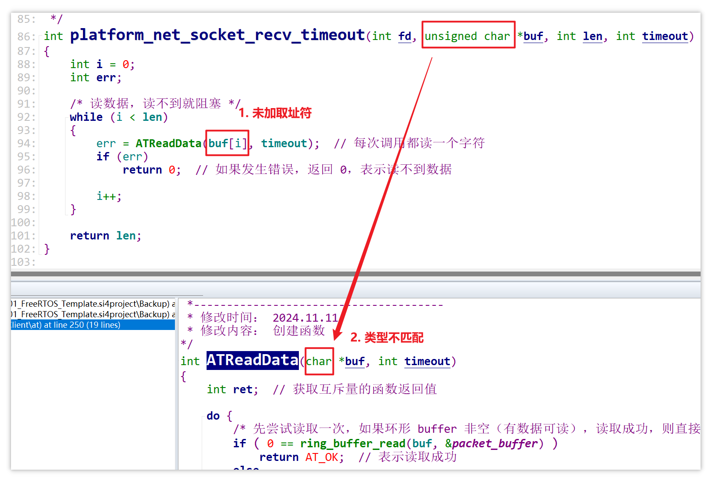

# 1. 编写网络连接函数

编写网络连接函数之前，先修改 `at_command.c` 中的 `ATSendCmd` 函数，原本传入的 `len` 参数是非必要选项，取消传入 `len` 参数，改用 `strlen` 函数计算命令的长度：


网络连接函数在以下文件中实现：

```
工程目录\MQTTClient\platform\FreeRTOS\platform_net_socket.c
```

网络连接函数功能及参数：

```c
/* 函数名  ： platform_net_socket_connect
 * 输入参数： host --> 服务器 IP 地址
 *          port --> 服务器端口号
 *          proto --> 协议，TCP 或 UDP
 * 输出参数： 无
 * 返回值  ： < 0, err
 *            = 0, ok
 * 函数功能： 将 WiFi 模块连接到服务器
 *------------------------------------------------------------
 * 修改时间： 2021.11.10
 * 修改内容： 创建函数
 */
int platform_net_socket_connect(const char *host, const char *port, int proto);
```

如何将 WiFi 模块连接到服务器？按以下三步实现：

1. 配置 ESP8266 的 WiFi 模式
2. 将 ESP8266 连接到路由器（提供 WiFi 名称和 WiFi 密码）
3. 透过路由器与服务器建立 TCP 或 UDP 连接（提供服务器 IP、端口，以及 `proto` 参数）

如何配置 WiFi 模式？

- 发送以下 AT 命令：

  ```c
  AT+CWMODE=3    // softAP+station 模式
  ```


如何连接到路由器？

- 发送以下格式的 AT 命令

  ```
  AT+CWJAP="WiFi名称","WiFi密码"
  ```

- 具体实现：

  1. 定义两个宏表示 WiFi 名称和 WiFi 密码，比如：

     ```c
     #define TEST_SSID      "Tenda_xxxx"  /* 路由器 ID  */
     #define TEST_PASSWORD  "xxxxxxxxxx"  /* 路由器密码 */
     ```

  2. 使用字符串拼接

     ```c
     int platform_net_socket_connect(const char *host, const char *port, int proto)
     {
     	/* 1. 配置 WiFi 模式 */
     
         /* 2. 连接路由器 */
     	if (err = ATSendCmd("AT+CWJAP=\"" TEST_SSID "\",\"" TEST_PASSWORD "\"", NULL, 0, 2000))
     	{
     		printf("Connect AP err = %d\n", err);  // 打印错误信息
     		return err;
     	}	
         
     	/* 3. 连接服务器 */
     }
     ```

如何确定 `proto` 的取值？

- 参考 [mqttclient](assets/source/SampleCodes/mqttclient) 中的测试函数，根据以下调用关系追踪到 `proto` 的取值

  

- `proto` 有两个取值：

  ```c
  #define PLATFORM_NET_PROTO_TCP  0 /* 取值为 0 表示使用 TCP 协议 */
  #define PLATFORM_NET_PROTO_UDP  1 /* 取值为 1 表示使用 UDP 协议 */
  ```

- 当前编写的 `platform_net_socket_connect` 函数是一个网络接口函数，要根据传入的 `proto` 参数的取值发送不同的命令来建立 TCP 连接或 UDP 连接，因此要先根据 `proto` 的取值构造命令，再发送命令

  - 构造出来的命令格式（以建立 TCP 连接为例）：

    ```
    AT+CIPSTART="TCP","192.168.0.202",1883  
    ```

    192.168.0.202 是服务器 IP，即 `host` 参数；1883 是服务器端口，即 `port` 参数

  - 构造及发送命令的实现：

    ```c
    int platform_net_socket_connect(const char *host, const char *port, int proto)
    {
        char cmd[100];  // 存放构造出来的 TCP 连接或 UDP 连接命令
        
        /* 1. 配置 WiFi 模式 */
        
        /* 2. 连接路由器 */
        
        /* 3. 连接服务器 */
        /* 3.1 构造 TCP 或 UDP 连接命令 */
        if (proto == PLATFORM_NET_PROTO_TCP)
    	{
    		sprintf(cmd, "AT+CIPSTART=\"TCP\",\"%s\",%s", host, port);  /* 构造 TCP 连接命令 */
    	}
    	else if (proto == PLATFORM_NET_PROTO_UDP)
    	{
    		sprintf(cmd, "AT+CIPSTART=\"UDP\",\"%s\",%s", host, port);  /* 构造 TCP 连接命令 */
    	}
    }
    ```
  
- `sprintf` 函数的使用方式可参考： [00_知识点杂项.md](./00_知识点杂项.md) 

完整的函数实现：


# 2. 编写网络断连函数

接下来要实现 `platform_net_socket_close` 函数，该函数会被 `nettype_tcp.c` 中的 `nettype_tcp_disconnect` 函数调用：


断开 TCP 连接的 AT 命令为：

```
AT+CIPCLOSE
```

函数实现比较简单：

```c
int platform_net_socket_close(int fd)
{
	return ATSendCmd("AT+CIPCLOSE", NULL, 0, 2000);
}
```


# 3. 编写网络发送函数

接下来要编写的网络发送函数为：


首先梳理使用 AT 命令向服务器发送数据的流程：

1. 首先发送以下 AT 命令，表示准备向服务端发送 n 个字节的数据：

   ```
   AT+CIPSEND=4
   ```

2. 如果命令成功发送，ESP8266 会得到 OK 响应和 `>` 字符，这时候再发送 n 个字节的数据，比如：

   ```
   test
   ```

3. 参考在 PC 上连接 ESP8266 向服务端发送数据时的流程：

   ```
   [02:43:48.843]发→◇AT+CIPSEND=4                             // 发送：要向服务端发送 4 个字节的数据
   □
   [02:43:48.848]收←◆AT+CIPSEND=4
   
   OK                                                         // 响应结束
   > 
   [02:43:58.941]发→◇test□                                    // 发送：4 个字节的数据
   [02:43:58.946]收←◆
   Recv 4 bytes
   
   [02:44:01.898]收←◆
   SEND OK                                                    // 响应结束
   ```

值得注意的是，如果允许发送数据，ESP8266 除了返回 OK 响应，还会返回一个 `>` 字符。

在 ESP8266 接收到 `>` 字符之后，再发送的数据才是真正要发送给服务器的信息。

而前面编写的 ESP8266 数据解析任务函数并未对特殊响应 `>` 考虑在内，因此在实现网络发送函数之前，要先改造 `at_command.c` 中的 `ATRecvParser` 任务函数。

## 3.1 改造解析任务函数

首先创建一个全局的 buffer，记录当前发送出去的 AT 命令：


当发送了一个 AT 命令后，马上将当次 AT 命令记录到 `g_cur_cmd`：


当发送了 `AT+CIPSEND` 命令表示要向服务器发送网络数据时，ESP8266 会先接收到一次 OK 响应，再接收到 `>` 字符。

因此 `ATRecvParser` 任务函数会先进入一次 `OK\r\n` 分支，随后重置 `buf` 中下一次保存数据的位置为 0。

接着下一次循环会进入一个新的分支，在该分支中判断当前命令是否为 `AT+CIPSEND` 类型的命令以及是否获得了 `>` 字符，如果是，则释放一个互斥量：


实现一个 `GetCIPSENDResp` 来判断是否获得了 `AI+CIPSEND` 类型的响应：


## 3.2 实现数据发送函数

再仿照 `ATSendCmd` 函数实现一个 `ATSendData` 函数，区别是前者发送 AT 命令，后者向服务端发送网络数据：


## 3.3 实现网络发送函数

最终实现 `platform_net_socket_write_timeout` 函数：


## 代码漏洞

回顾前面所写的代码，目测会有一些 BUG，比如 `ATRecvParser` 中新增的 `GetCIPSENDResp` 判断分支：


这么做的话，当 `platform_net_socket_write_timeout` 函数调用 `ATSendCmd` 发送一次 `AT+CIPSEND` 类型命令，解析线程就会触发两次解锁互斥量：

- 第一次进入 `OK\r\n` 分支时，会释放一次互斥量，唤醒 `platform_net_socket_write_timeout`，这时 `ATSendData` 函数马上就可以运行了

- 第二次进入 `GetCIPSENDResp` 的判断分支时，可能 `ATSendData` 已经开始发送网络数据了，如下图：

  

对于这个有可能发生的 BUG，目前暂时不解决，后续调试程序时再处理。

==当前编写进度保存在 [08_Socket_Cmd_Send](./assets/source/08_Socket_Cmd_Send) 目录下。==


# 4. 编写网络收包函数

要实现的网络收包函数为 `platform_net_socket_recv_timeout` ：


## 4.1 回顾 AT 命令层的收包函数


回顾之前的程序层次可知，在之前实现的 AT 层收包函数 `ATReadPacket` 中，接收来自网络的数据是这样的流程：

- 当 USART2 接收到从 ESP8266 传来的网络数据（不请自来的数据）时，USART2 的接收中断处理函数会解锁互斥量唤醒解析线程中的 `ATRecvParser` 任务函数

- 解析任务函数 `ATRecvParser` 会逐个字节地读取 USART2 的环形缓冲区 `uart_buffer` 中存放的网络数据

  

- `ATRecvParser` 就会进入 `"+IPD,"` 分支，将网络数据转存至一个专用的全局缓冲区 `g_at_packet`，然后释放互斥量 `at_packet_mutex` 唤醒 AT 层的收包函数 `ATReadPacket`

- `ATReadPacket` 收包函数会读走缓冲区 `g_at_packet` 中保存的网络数据，放到 `buf` 中（“谁 ” 调用 `ATReadPacket` “谁” 提供这个 `buf`），那么 AT 层读取网络数据总的流程就是：

  

 ## 4.2 改造 AT 收包函数

注意到：在上述流程中，`ATReadPacket` 是将全局缓冲区 `g_at_packet` 中存放的一整条网络数据放到 `buf` 里。

现在我们希望 `platform` 层的网络收包函数内部采取**逐个字节读取数据**的方法来获取网络数据，显然再使用 `ATReadPacket` 函数来读网络数据就不合适，因为 `ATReadPacket` 是一次性收集完一整条网络数据，整条数据存入 `buf` 中。

因此要弃用原来的 `ATReadPacket` 函数，重新实现一个 `ATReadData` 函数，后续再完善 `platform_net_socket_recv_timeout` 函数。

要逐个字节地读、写数据，使用环形缓冲区是更高效的办法，因此 `ATReadData` 将会使用环形缓冲区。

`ATReadData` 函数的大致框架：

```c
/* 先在前面定义一个环形 buffer，作为网络数据包的缓冲区 */
static ring_buffer packet_buffer;          // 网络数据的环形缓冲区

int ATReadData(char *buf, int timeout)
{
    int rer;  // 判断
    
    /* 先从环形缓冲区 packet_buffer 中读一个字节到 buf
     * 如果 packet_buffer 非空，则直接读取成功并返回
     */
    if ( 0 == ring_buffer_write(buf[i], &packet_buffer) )
        return AT_OK;
    
    /* 如果 packet_buffer 已经空了，读不到就阻塞，
     * 直到有线程向 packet_buffer 写入数据并且唤醒我
     */
}
```

这里定义了一个环形缓冲区 `packet_buffer` 作为网络数据包的缓冲区，那缓冲区中的网络数据是由谁放进来的？

对于这个问题，要先回顾之前解析线程是怎么存放网络数据的：


如上图，当 ESP8266 传回来一条网络数据，解析任务函数会将整条网络数据都保存到全局缓冲区 `g_at_packet`。

而我们重写的 `ATReadData` 函数要从环形缓冲区 `packet_buffer` 读网络数据，那么解析线程所调用的 `ProcessSpecialATString` 应该改为将网络数据保存到环形缓冲区 `packet_buffer` ：

- 弃用 `g_at_packet` 全局缓冲区

- 该为将网络数据存入环形缓冲区 `packet_buffer` 中

- 每存入一个字节到 `packet_buffer` 都要释放互斥量 `at_packet_mutex` 唤醒 `ATReadData`。注意，之前是存完一整条网络数据才释放互斥量，如图：

  

网络数据处理函数 `ProcessSpecialATString` 修改前后对比：


那么 `ATReadData` 函数就可以实现了：


将该函数声明添加到头文件中，后面要实现的网络收包函数 `platform_net_socket_recv_timeout` 就可以调用它了。

### AT 收包函数的设计细节

在 `ATReadData` 函数中，为什么不 “先阻塞，后读取”，比如这样：

```c
int ATReadData(char *buf, int timeout)
{
	int ret;  // 获取互斥量的函数返回值

    /* 阻塞等待新的数据被写入网络数据包的环形 buffer 中 */
    ret = platform_mutex_lock_timeout(&at_packet_mutex, timeout);
    
    if (ret == pdTRUE)
    {
        /* 等到新的数据，就从环形 buffer 中读出一个字节 */
        ring_buffer_read(buf, &packet_buffer);
        return AT_OK;
    }
    else
        return AT_TIMEOUT;  /* 超时 */
}
```

这样写貌似更直观，但却有一个致命的错误：

- 假设 A 线程调用了解析任务函数，当解析任务函数接收到了网络数据，就会逐个字节地向网络数据的环形缓冲区 `packet_buffer` 写入数据，并且每写入一个字节就释放一次互斥锁

  

- 假设 B 线程为了获得完整的一条网络数据，循环调用了 AT 收包函数 `ATReadData`，理想的情况是：A 线程每释放一次互斥锁，B 线程就获得一次互斥锁，然后读走 `packet_buffer` 里面一个字节的数据

- 但是在 FreeRTOS 中，A 线程释放了互斥锁唤醒了 B 线程，未必就会马上将 B 线程调度出来运行（所谓的 “唤醒” 只是将 B 线程放到 **就绪态**，不代表 B 线程马上就可以运行），那么就很有可能出现这样的情况：

  - A 线程向 `packet_buffer` 写入一个字节，第一次释放互斥锁唤醒 B 线程，但是 B 线程未必马上运行
  - A 线程第二次释放互斥锁失败（因为 B 没有获取互斥量，互斥量的值仍为 1），但 `packet_buffer` 已经被写入两个新的数据了，此时 B 线程仍未马上运行
  - 第三次、第四次 ......
  - 直到 A 线程第 N 次写入一个字节到 `packet_buffer`，第 N 次释放互斥锁（释放失败，互斥量仍为 1）时，B 线程得到了运行权限，开始循环地调用 `ATReadData` 函数，此时 B 线程中就会发生这样的事情：
    - 由于互斥量为 1，第一次调用 `ATReadData` 时，马上能够获得互斥量（同时还将互斥量置为 0）并向下运行，成功读取到了一个字节，并且很可能还没轮到 A 解析线程运行
    - B 线程继续运行，想要从 `packet_buffer` 里读出第二个字节的新数据，于是第二次调用 `ATReadData` 函数，但是被阻塞了，无法获得第二个字节的数据
  - B 线程被阻塞，A 就出来运行，向 `packet_buffer` 写入第 N+1 个字符

由上述分析可知，`ATReadData` 函数中先阻塞后读取是不可行的，正确的方法依然是：

```c
int ATReadData(char *buf, int timeout)
{
	int ret;  // 获取互斥量的函数返回值

	do {
		/* 先尝试读取一次，如果环形 buffer 非空（有数据可读），读取成功，则直接返回 OK */
		if ( 0 == ring_buffer_read(buf, &packet_buffer) )
			return AT_OK;  // 表示读取成功
		else
		{
			/* 如果环形 buffer 空了（无数据可读），则阻塞，等待其它线程将数据写入环形 buffer 并唤醒我 */
			ret = platform_mutex_lock_timeout(&at_packet_mutex, timeout);
			/* 如果返回值为 pdFALSE：表示超时无法取得互斥量（在规定时间内没有新的数据被写入环形 buffer 中），
			 * 那么就返回 TIMEOUT
			 */
			if (ret == pdFALSE)
				return AT_TIMEOUT;
		}
	} while (ret == pdTRUE)  /* 如果规定时间内唤醒了，就重新读一次 */
}
```

这样做的话，即使 A 解析线程向 `packet_buffer` 写入了多个字符，B 线程在它自己的运行周期内都可以一直读 `packet_buffer` 中的数据，除非它在这个周期内将 `packet_buffer` 读空了，才会阻塞，切换 A 线程出来写数据进这个 buffer。

## 4.3 实现网络收包函数

首先确定网络收包函数的返回值，由上层函数调用关系可知，网络收包函数的返回值应该是读到的网络数据的长度：


因此网络收包函数的实现为：


# 5. 解决编译错误

1. 解决错误：

   

   错误原因：

   

   更改：

   

2. 解决错误：

   

3. 解决警告：

   

   这几个警告的原因都是在判断条件中进行了赋值操作，把这几个警告出现的地方都修改为这种形式：

   

4. 解决警告：

   

   警告原因是类型不匹配：

   

   将 `ATSendData` 的参数改为 `unsigned char *` 类型：

   

5. 解决警告：

   

   直接添加类型转换，免得下层函数还要继续改参数类型，在这里将无符号强制转化为有符号没有关系（只要数值不太大就行）：

   

6. 解决警告：

   

   警告原因：漏了返回值。

   增加一个返回值就行：

   

所有网络函数均已实现，编译错误和警告都已解决，==当前工程进度保存到 [09_Socket_Compiled_Successfully](assets/source/09_Socket_Compiled_Successfully) 目录下==。 
