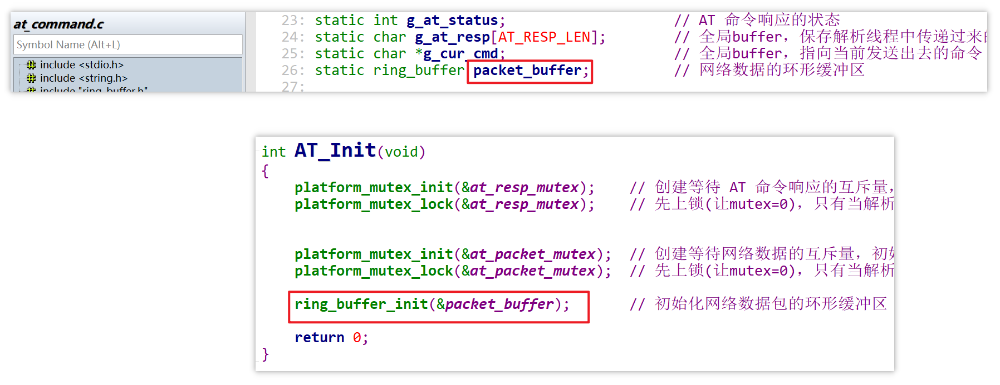
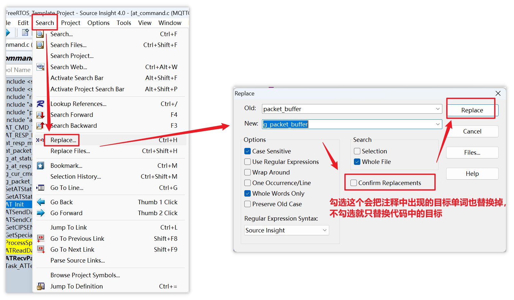
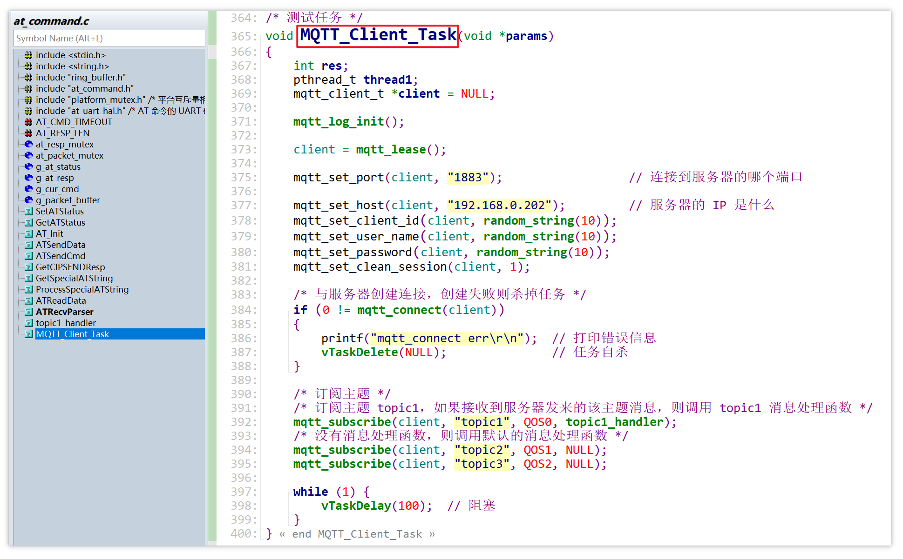
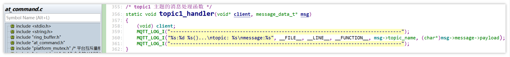
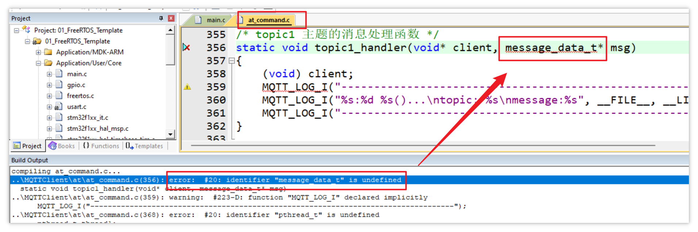
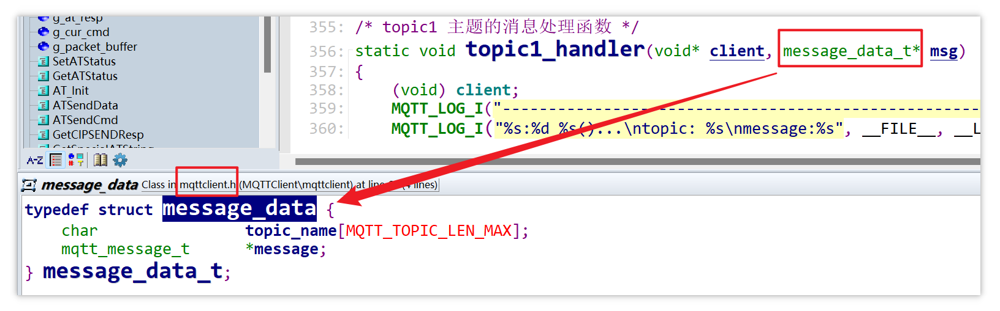
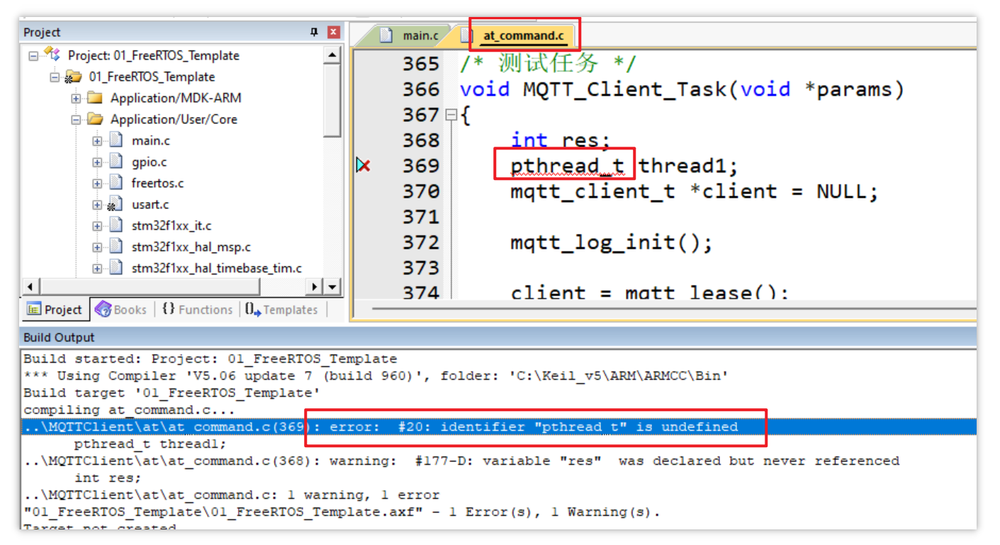
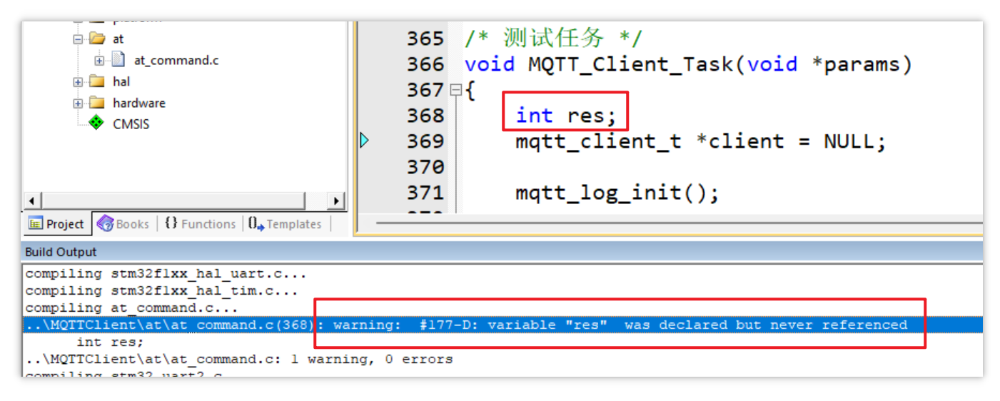

# 1. 代码整体检查

1. 在 `at_command.c` 中，网络数据包 `packet_buffer` 创建后未初始化，在 `AT_Init` 中对 `packet_buffer` 增加初始化函数：

   

2. `packet_buffer` 是一个全局变量，更名为：`g_packet_buffer`

   

# 2. 添加 MQTT 测试任务

在 `at_command.c` 中，将原来的测试任务改为 MQTT 测试任务：

同时实现一个 `topic` 主题的消息处理函数：

# 3. 解决编译错误

1. 解决错误：

   

   错误原因：该类型在 MQTT 源码提供的头文件 `mqttclient.h` 中被定义

   

   将 `mqttclient.h` 包含即可。

2. 解决错误：

   

   错误原因：`pthread_t` 是 Linux 系统的线程句柄类型，不适用于 FreeRTOS，当前未创建线程，删除该行即可。

3. 解决警告：

   

   删除该行即可。

所有编译错误与警告均解决，==当前进度保存在 [10_Create_MQTT_Task](assets/source/10_Create_MQTT_Task) 目录下。==

