# 1. 安装软件

1. 安装 [mosquitto-2.0.14-install-windows-x64.exe](assets/APP/mosquitto-2.0.14-install-windows-x64.exe) 到默认路径

   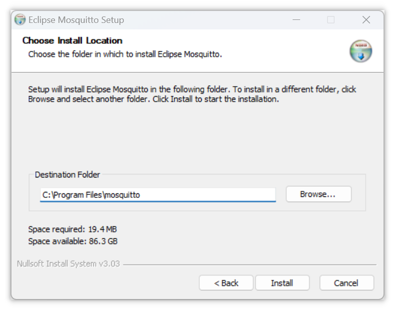

2. 安装 [MQTTX-Setup-1.7.2-x64.exe](assets/APP/MQTTX-Setup-1.7.2-x64.exe) 


# 2. 运行服务器（本地模式）

打开命令行，执行以下两条命令运行 mosquitto.exe（运行在本地的服务器）：

```shell
cd  "c:\Program Files\mosquitto"
.\mosquitto.exe -v
```

得到以下返回信息表示 mosquitto.exe 运行成功：

```shell
1731407549: mosquitto version 2.0.14 starting
1731407549: Using default config.
1731407549: Starting in local only mode. Connections will only be possible from clients running on this machine.
1731407549: Create a configuration file which defines a listener to allow remote access.
1731407549: For more details see https://mosquitto.org/documentation/authentication-methods/
1731407549: Opening ipv4 listen socket on port 1883.
1731407549: Opening ipv6 listen socket on port 1883.
1731407549: mosquitto version 2.0.14 running
```

保持后台运行 mosquitto.exe，该窗口是服务器窗口。


# 3. 运行客户端（无法远程连接）

1. 运行 MQTTX，新建一个客户端，设置客户端名称，填入服务器地址（即本地 ip），点击连接：

   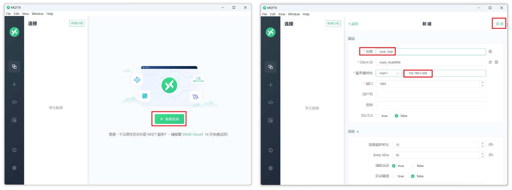

   连接失败：

   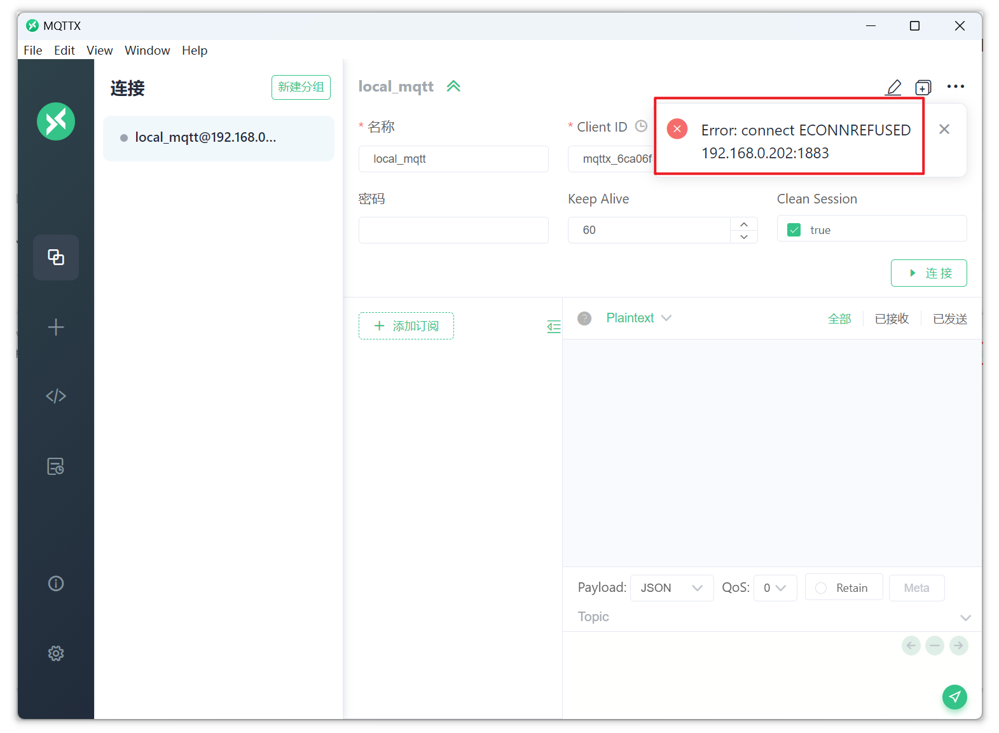


# 4. 重新运行服务器（允许远程连接）

1. 回顾运行 mosquitto.exe （服务器）时的返回信息，原因在其中的两行信息中：

   ```shell
   1731407549: Starting in local only mode. Connections will only be possible from clients running on this machine.
   1731407549: Create a configuration file which defines a listener to allow remote access.
   ```

   该信息表示默认只允许使用本地模式（即只允许运行在本地的设备端来连接本地的服务端，并且创建客户端时必须将服务端 IP 固定设置为 `127.0.0.1`），如果要使用非本地的设备端来远程连接此服务端，还需要在配置文件中进行设置。

2. mosquitto 的配置文件路径：

   ```
   "C:\Program Files\mosquitto\mosquitto.conf"
   ```

   打开配置文件，定位到以下内容配置端口号：

   ```
   # listener port-number [ip address/host name/unix socket path]
   #listener
   ```

   修改为：

   ```
   # listener port-number [ip address/host name/unix socket path]
   listener 1883
   ```

   定位到以下内容启用匿名访问：

   ```
   # Defaults to false, unless there are no listeners defined in the configuration
   # file, in which case it is set to true, but connections are only allowed from
   # the local machine.
   #allow_anonymous false
   ```

   修改为：

   ```
   # Defaults to false, unless there are no listeners defined in the configuration
   # file, in which case it is set to true, but connections are only allowed from
   # the local machine.
   allow_anonymous true
   ```

3. 退出原来运行的 mosquitto.exe，重新打开命令行执行以下命令运行 mosquitto.exe：

   ```shell
   cd  "c:\Program Files\mosquitto"
   mosquitto.exe -c mosquitto.conf -v
   ```

   返回信息如下：

   ```shell
   1731417992: mosquitto version 2.0.14 starting
   1731417992: Config loaded from mosquitto.conf.
   1731417992: Opening ipv6 listen socket on port 1883.
   1731417992: Opening ipv4 listen socket on port 1883.
   1731417992: mosquitto version 2.0.14 running
   ```

   可以看到返回信息中已经没有了 `Starting in local only mode`，可以使用设备端远程连接了


# 5. 实现远程连接

重新连接成功：

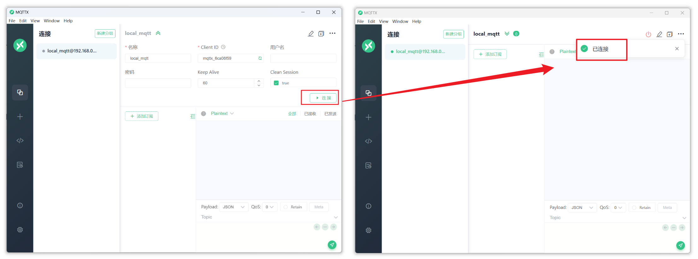

这样客户端虽然也是运行在本地，但是实际使用的是远程连接的方式来连接到服务器。

也就是说，MQTTX 客户端和 mosquitto 服务端之间的通信需要经过路由器完成。


# 6. 订阅主题消息

1. 点击 “添加订阅”：

   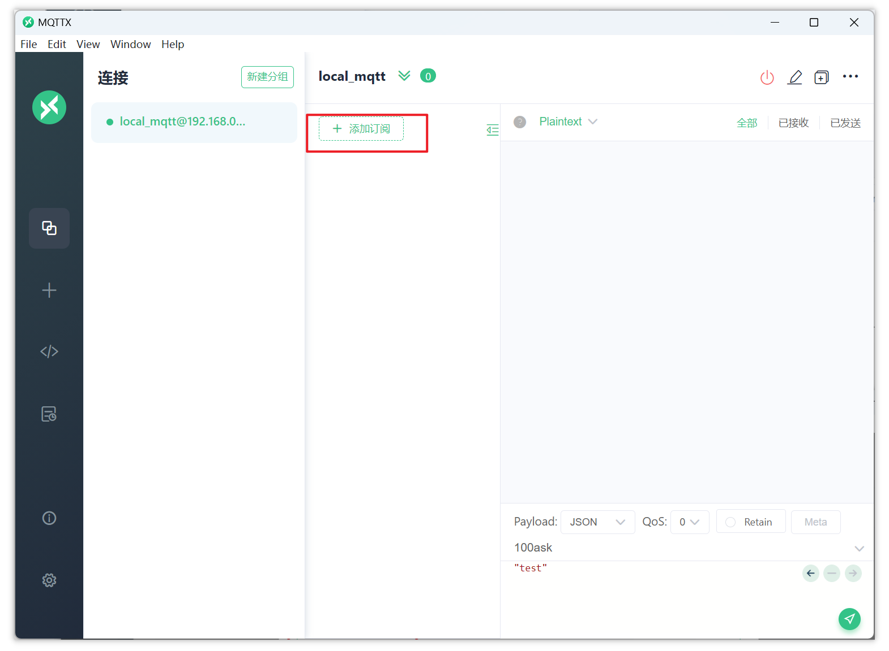

2. 设置要订阅的主题的名称为 `topic1`

   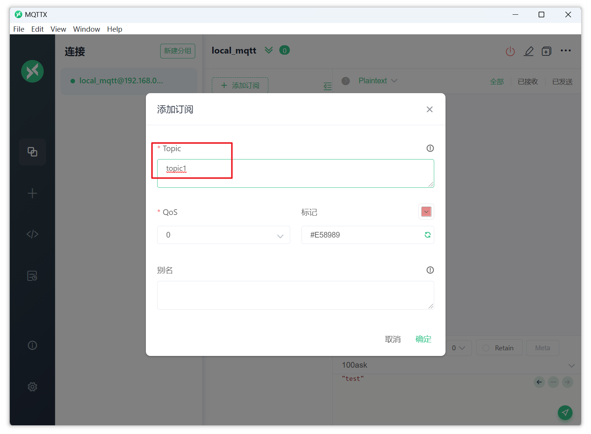


# 7. 发布主题消息

1. 设置 Payload 为 Plaintext，这样发布消息的时候就不用加双引号：

   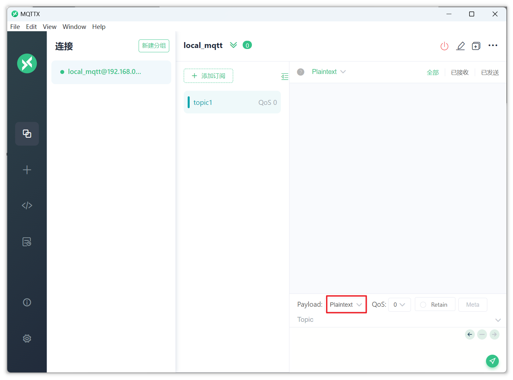

2. 目前 MQTTX 上只创建了一个客户端，并且该客户端订阅了名为 `topic1` 的主题，现在又用这个客户端发送 `topic1` 主题下的消息 `testmessage`：

   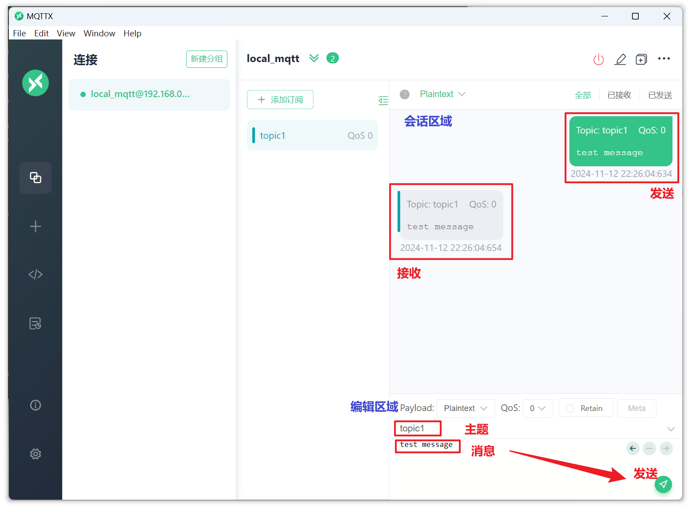

   可以看到，客户端接收到了自己发布出去的消息，这是因为服务器在接收到某个客户端发布的 `topic1` 主题消息后，会向所有订阅了该主题的客户端发送该消息。

   如果发布这条消息的客户端自己也订阅了该主题，服务器也会将这条消息发回来。

   也就是说，客户端既可以订阅，也可以发布，甚至可以同时作为一个主题的发布者和订阅者，服务器的响应可以印证这一点：

   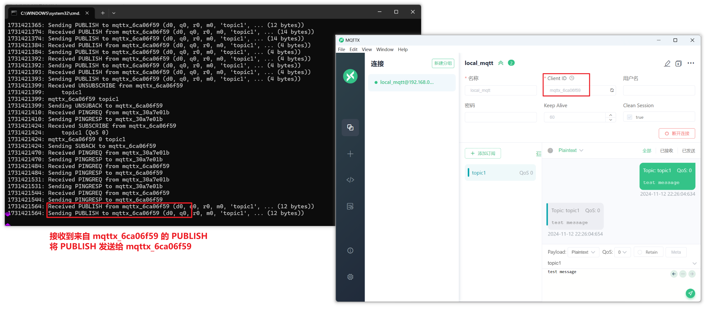

3. 现在创建第二个客户端，来体验 MQTT 分发数据

   将第二个客户端命名为 `local_mqtt_2`，连接到服务器，并且也订阅 `topic1` 主题：

   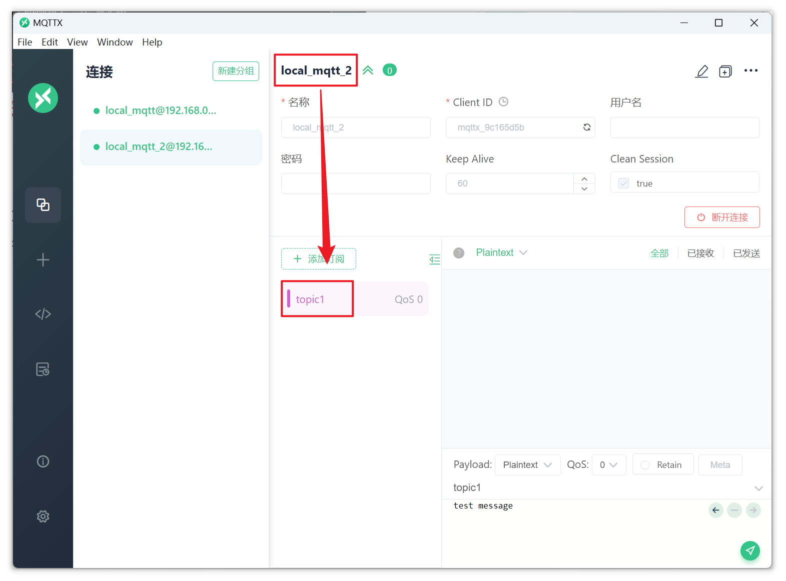

   用第一个客户端发送 `topic1` 主题下的 `test` 消息，两个客户端都收到了服务器的转发：

   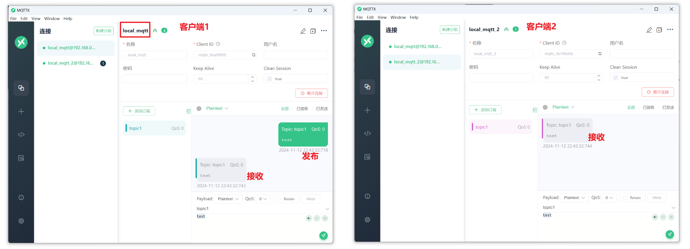

   服务器的响应如图：

   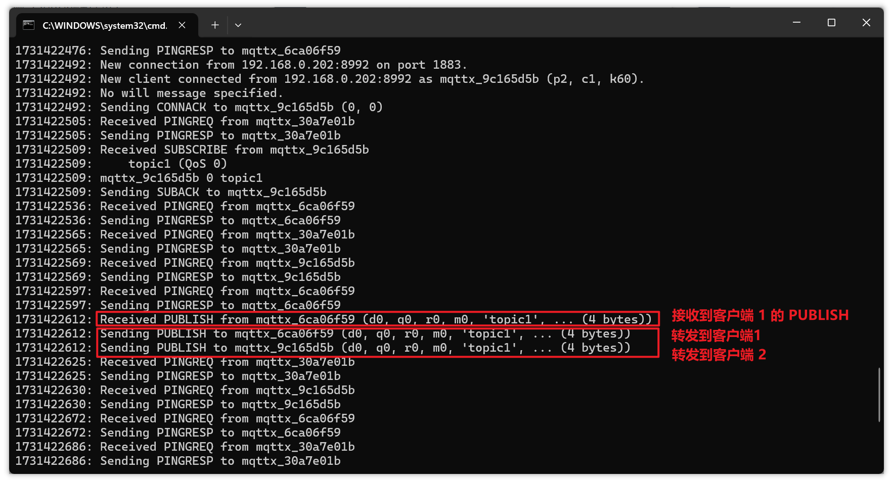

   退出服务器，体验完成。


# 8. 使用命令行订阅、发布主题消息

前面使用了图形化的客户端界面来订阅和发布主题消息，接下来使用命令行订阅和发布。

重新运行服务器，执行以下命令：

```shell
cd  "c:\Program Files\mosquitto"
mosquitto.exe -c mosquitto.conf -v
```

服务器运行成功：

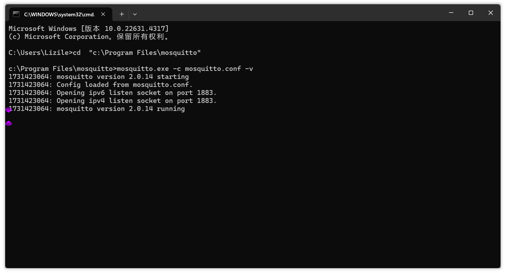

打开第二个命令行窗口，用来订阅消息，执行以下命令，表示连接到服务器 `192.168.0.202`，并订阅主题 `topic1`：

```shell
cd  "c:\Program Files\mosquitto"
.\mosquitto_sub.exe -h 192.168.0.202 -p 1883  -t "topic1"
```

第二个窗口等待消息：

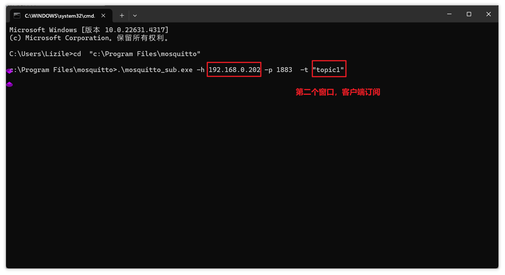

打开第三个窗口，用来发布消息。执行以下命令，表示连接到服务器 `192.168.0.202`，并发送 `topic1` 主题下的 `test message` 消息：

```shell
cd  "c:\Program Files\mosquitto"
.\mosquitto_pub.exe -h 192.168.0.202 -p 1883  -t "topic1" -m "test message"
```

第三个窗口发送了主题消息：

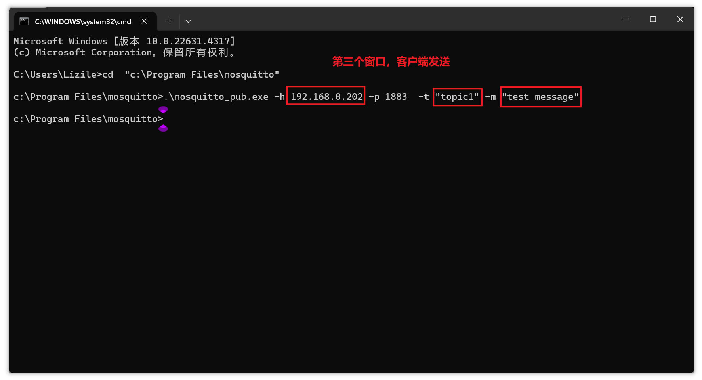

第二个窗口，接收到了主题消息：

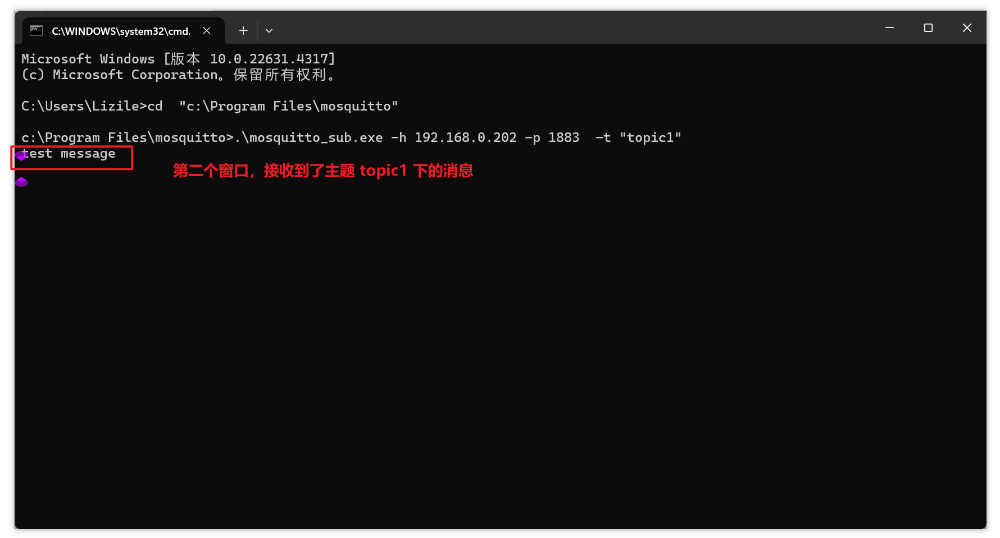

第一个窗口（服务器）的响应：

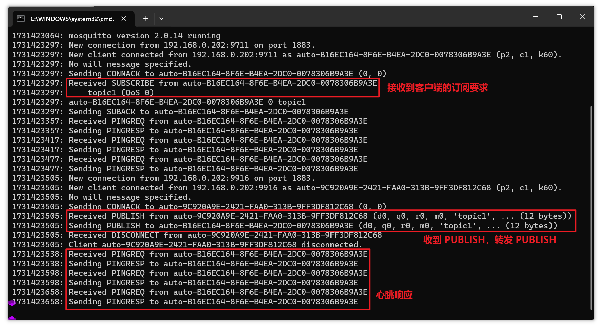

以上就是在 Windows 上体验 MQTT 的过程。