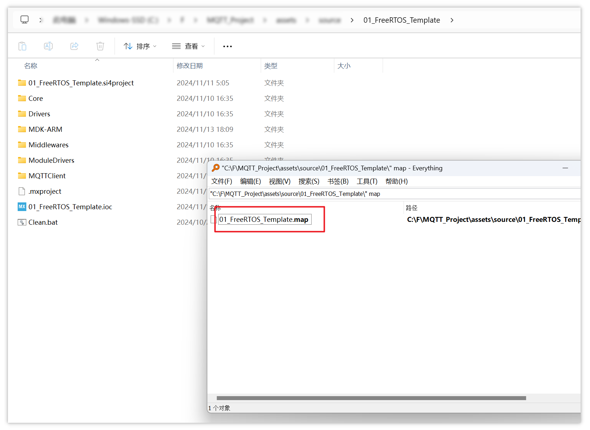
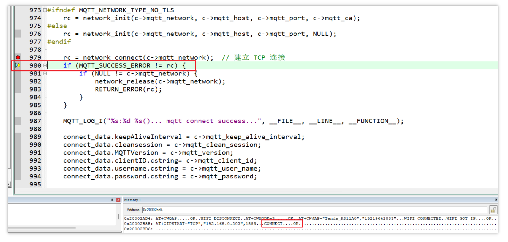
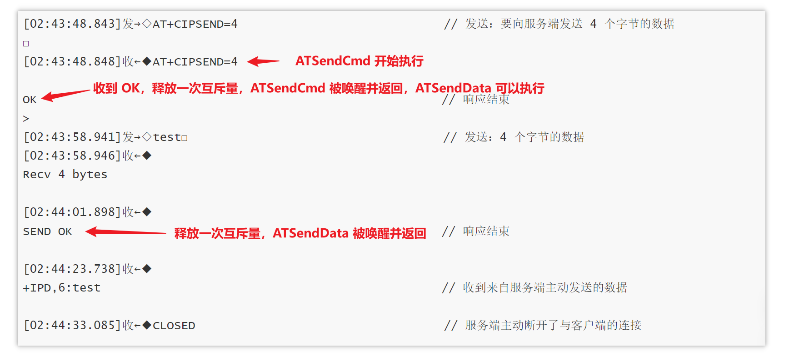

# 1. 解决堆不足_网络连接错误

进入调试模式，全速运行，程序卡死在硬件错误处理函数 `HardFault_Handler`：


由函数调用关系可知，该错误发生在 `MQTT_Client_Task` 任务函数中，执行 memset 时导致了 HartdFault。

重新调试，定位到 `platform_memory_alloc`，发现 Bug：`ptr` 没有分配成功，仍然是 NULL，如果继续执行 memset 就会崩溃


在执行 memset 之前，应该先判断 `ptr` 是否为空，像这样：


而 `ptr` 没有成功分配到内存的原因是堆空间不足，打开 CubeMX，此前将堆空间设置为 3k，采用的堆算法是 `heap_4`，可以根据直接在 CubeMX 上修改堆空间的分配，重新生成代码：


本项目使用的是 STM32F103C8T6 芯片，根据参考手册和数据手册可知内存容量为 20K：


可以直接在 CubeMX 中直接增加堆空间，也可以自己在配置代码中修改，定位到 `FreeRTOSConfig.h` 中的宏 `configTOTAL_HEAP_SIZE`，将其值适当增加到 5k：


重新调试，成功执行 `platform_memory_alloc` 分配到了内存：


继续单步执行到 MQTT 测试任务函数 `MQTT_Client_Task` 中的 `mqtt_connect`，其返回值不为 0，说明连接错误，并打印错误信息：


重新调试，单步运行到 `platform_net_socket_connect` 函数中发起连接路由器的命令，返回值不为 0，说明在此出错：


`err` 的返回值为 `0xFFFFFFFE`，即 -2，说明该命令发送超时。

重新进入调试模式，运行到此处时，进入 `ATSendCmd` 内部单步运行，可以看到函数内部等待响应超时，一直没有得到互斥锁：


AT 命令确实发送了出去：


但解析任务函数一直没有释放互斥锁，那么观察一下 UART2 的环形缓冲区 `uart2_buffer` 接收到的 ESP8266 原始返回数据是怎么样的。

在工程目录中打开 `map` 文件：



定位到 `uart2_buffer`，找到其内存地址为 `0x20002ad4`：


在 keil 的 memory 窗口查看该地址的数据：


右键 `Ascii` 切换为 ASCII 码形式的数据：


重新调试运行，当发送连接路由器的命令时，接收到的信息是 `WIFI DISCONNECT`：


猜测在连接路由器之前，需要先断开原来的 WiFi 连接。

参考 [4a-esp8266_at_instruction_set_en.pdf](assets/doc/4a-esp8266_at_instruction_set_en.pdf) 中断开 WiFi 连接的 AT 命令为：

```
AT+CWQAP
```

其响应为 `OK`：


修改代码，连接 WiFi 之前先断开原有的连接：


重新调试，发现先配置 WiFi 模式，再断开原来的连接时无法得到 `OK`：


调整代码，发送命令的顺序改为先断开原来的连接，再配置 WiFi 模式，两次命令就都能得到 `OK`：


原因尚不清楚。

同时发现 ESP8266 返回的数据中出现不明字符 `W`，并且最后发送的连接路由器命令没有收到 `OK`，`ATSendCmd` 尝试获取互斥量超时失败：


==当前调试进度保存在 [11_Debug_heapError_Fixed](assets/source/11_Debug_heapError_Fixed) 目录下。==


# 2. 连接 WiFi 热点

当 `platform_net_socket_connect` 函数调用 `ATSendCmd` 来发送 WiFi 连接命令时，在 `ATSendCmd` 内部等待互斥量 `at_resp_mutex`：


调试的时候，运行到这一步总是超时退出：


说明发起 WiFi 连接时，无法在规定时间（2000ms）内获得互斥量。

尝试将超时时间设置得更长（20s），看看能否成功获得互斥量：


重新编译、调试，再次运行到发送 WiFi 连接命令并等待互斥量这里，单步运行，发现在尝试获取互斥量时，并没有等待足够 20 秒，`platform_mutex_lock_timeout` 函数就返回了：


经过检查，`platform_net_socket_connect` 调用 `ATSendCmd` 时传入的超时时间 `timeout` 为 20000，但 `ATSendCmd` 在调用 `platform_mutex_lock_timeout` 来等待互斥量时并没有使用这个 `timeout`，而是使用了一个宏 `AT_CMD_TIMEOUT`：


这就是问题所在，发送连接 WiFi 命令后等待响应的时间可能比发送其它 AT 命令时更长，但是尝试获取响应互斥量 `at_resp_mutex` 时，最终传入的超时时间固定为 1 秒，不足以等到完整的响应。

改掉这个 Bug：


重新编译、调试，连接成功：


同样的，`ATSendData` 函数中，获取互斥量时也有这样的 Bug：


修改：


# 3. 连接服务器

首先运行服务器，打开命令行，执行以下两条命令：

```shell
cd  "c:\Program Files\mosquitto"
mosquitto.exe -c mosquitto.conf -v
```

得到以下返回信息则表示服务器正常运行：


删除所有断点，在发送连接服务器命令前保留一个断点：


全速运行到断点处，然后单步运行，没有返回 OK：


使用 `Step Out` 多运行几步，直到 `mqtt_connet` 函数返回，才收到如下信息：


观察服务器响应，ESP8266 已经成功连接服务器：


继续单步运行，出错，进入了任务自杀分支：


经过排查，在 `ATRecvParser` 解析任务函数中，如果进入分支之后再添加结束符 `'\0'` 就会出现上述现象。改为在进入分支之前就添加结束符（即所有分支都会添加结束符）：


重新编译、调试，在发送连接服务器的命令时，单步运行，马上就能得到 OK：


==当前调试进度保存在 [12_Debug_Server_Connected](assets/source/12_Debug_Server_Connected) 目录下。==


# 4. 解决数据发送 Bug

## 4.1 解决第一个 Bug

但是如果继续单步运行， `mqtt_connect` 执行完毕并返回到 `MQTT_Client_Task` 函数中时，ESP8266 就会收到如图所示的消息：


继续全速运行，与服务器断开连接，并且任务自杀了：


可以看到，程序在连接到服务器后，自动发送了 48 个字节的数据，然后又自动关闭了连接，说明以下函数被调用了：


在此函数中添加断点，全速调试：


查看调用关系，`mqtt_connect_with_results` 经过某些判断调用了 `network_release`，然后调用 `nettype_tcp_disconnect`，最终发送了断连命令：


在 `mqtt_connect_with_results` 中，程序有可能走以下几个分支调用 `network_release`：


经过调试确定：当程序在 `mqtt_connect_with_results` 函数中运行到 `mqtt_send_packet` 进行发包时发生了错误，根据返回值 `rc` 判断，进入了 `exit` 中的 `else` 分支，执行了 `network_release` 与服务器断开连接


观察到发包时的返回值 `rc` 的值是 `0xFFFFFFED`：


该错误码即 `-0x13`：


进入 `mqtt_send_packet` 分析，程序返回的是 `MQTT_SEND_PACKET_ERROR`：


程序正常运行时，`mqtt_send_packet` 应该走 `if` 分支，返回 0：


说明在 `while` 循环中，调用 `network_write` 函数时，返回值 `len` 有问题，导致了 `if` 判断出错：


而 `network_write` 函数实际是通过调用 `platform_net_socket_write_timeout` 来实现的：


并且通过观察 UART1 串口打印的调试信息可知，`platform_net_socket_write_timeout` 调用 `ATSendData` 时发生了错误，进入了错误判断分支：


另外还发现一个 Bug：`platform_net_socket_write_timeout` 没有发生错误时，应该返回发送的数据长度，而不是返回 0，修改后如图


## 4.2 解决第二个 Bug

重新调试运行，发包时仍然发生错误，ESP8266 接收到 `OK` 和 `>`，紧接着是 `Recv 48 bytes` ：


再次重新调试，逐步复盘，分析错误。

按照下图调用关系单步运行到 `network_connect` 发起连接：


`F10` 单步运行，连接成功：



继续向下 `F10` 单步运行到 `mqtt_send_packet` 时，`F11` 进入该函数内部：


之后 `F11`（进入函数内部）一路运行到：


`F10` 单步运行，成功发送命令并接收到 `OK`：


- **注意，这里是执行了 `ATSendData` 才接收到 `>` 字符**<a id="anchor-01"></a>，而之前体验 AT 命令时，发送数据应该在接收到 `>` 字符之后，如图：

  

  因此怀疑是否因为这一点导致 SendData 出错。

- 但是经过分析，这应该是因为调试模式下，单步运行执行完 `ATSendCmd` 函数后马上就停止了（函数一返回，程序就暂停），而在中断里接收 `'>'` 字符存入到 `uart2_buffer` 也需要一点时间，所以此时 `uart2_buffer` 里还没有 `>` 字符

- 可以在执行 `ATSendData` 函数前添加一个 `Delay`，重新调试，删除掉 `ATSendCmd` 的断点，并在 `ATSendData` 执行前添加断点，然后全速运行，就可以看到 `uart2_buffer` 接收到了 `>`：

  
  
- 这说明如果在调试模式下给 `uart2_buffer` 接收数据留一点时间，是能在 `ATSendData` 运行前就接收到 `>` 字符的。也就是说出现[前面的情况](#anchor-01)可以排除 `ATSendData` 函数的原因，这是调试模式的运行方式导致的。

**删除掉延时测试函数**，重新调试到 `ATSendData` 的位置，继续单步运行，接收到 `>` 字符<a id="anchor-02"></a>，但是却没有马上接收到 `Recv` 等字符串以及 `OK` 等信息，而且还出错，错误码为 `0xFFFFFFFF`，即 -1：


再 `F10` 单步运行，果然进入了 `if` 分支打印错误信息，并且接收到了 `Recv` 开头的字符串：


并且 UART1 串口打印的调试信息确实表示 `err` 为 -1：


`err` 的值为 -1是因为接收到 `>` 字符时，误将响应状态设置为了 ERR（值为 -1），并唤醒了 `ATSendData` 函数，使得 `ATSendData` 返回了 `err`，将此响应状态改成 `AT_OK` 即可：


## 4.3 解决第三个 Bug

重新编译、调试，`ATSendData` 函数没有返回错误了，但是在接收到 `>` 时 `ATSendData` 函数就提前返回了：


**注意，由于删除了前面延时测试的 Delay 函数，这里的 `ATSendData` 函数也是在接收到 `>` 字符前就执行了**，但这样一样能够成功发送 Data 并收到 `Recv` 等字符，说明 `ATSendData` 函数发送数据时根本不需要等待 `uart2_buffer` 接收到 `>` 字符！

如果以之前在 Windows 上体验 AT 命令时的响应为例，那么 `ATSendCmd` 和 `ATSendData` 的运行和唤醒时间正常来说应该是这样的：



而 `ATRecvParser` 函数在 `uart2_bufferr` 接收到 `>` 时，也释放一次互斥量，这就导致了实际的唤醒时间变成了：


所以 `ATSendData` 不应该等待 `>` 字符唤醒自己，而是应该直接等待 `"SEND OK\r\n"`，将解析任务函数中对 `>` 字符的判断分支删除，并且删除掉不再需要使用的 `g_cur_cmd` 全局缓冲区及其相关代码：


重新编译、调试，单步运行完 `ATSendData` 后，就能接收到 `OK` 了（应该说 `ATSendData` 现在是被 `OK\r\n` 字符串唤醒并返回的）：


发送数据 Bug 已解决，==当前调试进度保存在 [13_Debug_SendOK](assets/source/13_Debug_SendOK) 目录下==。


# 5. 解决读包错误

继续向下运行，`send connect packet` 成功：


读包错误：


添加断点，重新调试并运行到断点：


`F11` 进入函数 `MQTTDeserialize_connack` 内部单步运行，函数又正确返回了：


说明 `mqtt_wait_packet` 内部可能又概率发生错误，在 `mqtt_wait_packet` 处添加断点，重新调试，在该函数进入内部单步运行，一路调用到 `platform_net_socket_recv_timeout` 收包函数：


再单步运行，发现 `ATReadData` 函数返回了错误：


重新进入调试模式，这次进入 `ATReadData` 函数查看运行状况，发现 `ATReadData` 函数在等待互斥量 `at_packet_mutex` 时超时：


- `platform_mutex_lock_timeout` 函数是通过调用 FreeRTOS 的 `xSemaphoreTake` 函数来实现的。当该函数返回 `pdTRUE`（1）时，说明成功获得信号量；返回 `pdFalse` （0）时，说明获取信号量超时失败：

  

经过检查，`ATReadData` 函数要等待的互斥量 `at_packet_mutex` 是由网络数据处理函数 `ProcessSpecialATString` 释放的：


`ATReadData` 获取互斥量超时就说明 `ProcessSpecialATString` 函数有 Bug，经过排查，该函数存在一个始终无法退出的死循环：


将该死循环 `while(1)` 删除，并且在 `platform_net_socket_recv_timeout` 函数的错误分支中添加错误打印功能，监视错误码：


除此之外发现发送函数有一个小 Bug，其内部调用的 AT 发送函数的超时时间没有传入 `timeout`，是定死的，修改为 `timeout`：


重新调试，发现仍然有概率超时，猜测可能是配置文件中默认的超时时间不够长。

`ATReadData` 接收到的 `timeout` 参数是沿着如下路径传递的：


也就是说，`ATReadData` 接收到的 `timeout` 就是 `c->mqtt_cmd_timeout`，而 `c->mqtt_cmd_timeout` 是沿着如下路径被赋值的：


也就是说， `c->mqtt_cmd_timeout` 的值是由配置文件 `mqtt_defconfig.h` 中定义的宏 `MQTT_DEFAULT_CMD_TIMEOUT` 决定的。

将 `MQTT_DEFAULT_CMD_TIMEOUT` 的值适当增大，比如 10000，重新调试，能够正确返回：


==当前调试进度保存在 [14_Debug_ReadOK](assets/source/14_Debug_ReadOK) 目录下。==


# 6. 解决堆空间仍然不足的问题

删除所有断点，重新调试，全速运行，还是自动断开了连接：


说明 `platform_net_socket_close` 还是被调用了：


在该函数前添加断点，重新调试，全速运行，通过调用关系可知，还是在 `mqtt_connect_with_results` 中发生了某些错误，导致调用了 `network_release` 与服务器断开连接：


清除所有断点，在 `mqtt_connect` 前添加断点，重新调试，准备进入该函数单步运行寻找错误发生的位置：


`F11` 一路进入到 `mqtt_connect_with_results` 函数内部：


然后一路 `F10`，运行到 `network_connect` ，成功：


继续 `F10`，`mqtt_send_packet` 运行通过，不出错：


继续单步运行 `mqtt_wait_packet` 函数时，又出错：


猜测这是因为运行了 `mqtt_send_packet` 后，服务器马上就向 ESP8266 模块发包，如果在 `mqtt_wait_packet` 前暂停就会错失数据，导致接收数据超时。

因此直接在 `mqtt_wait_packet` 运行结束之后的位置打断点，重新调试，全速运行，果然能够运行到正确的分支：


接下来有可能会运行到下图中这两个 `network_release` 分支的其中之一，导致 ESP8266 与服务器断开连接，在这两个位置打断点：


全速运行，进入了第一个 `network_release` 分支：


分析错误发生在 `platform_thread_init` 内部，该函数执行后的返回值为空，导致进入了 `else` 分支，执行了 `network_release`：


推测程序若正常运行，`platform_thread_init` 函数的返回值不应为 `NULL`。根据该函数的名称推测，该函数应该是要创建一个名为 `mqtt_yield_thread` 的线程。

分析 `platform_thread_init` 函数，确实如此：


那么问题就在于，为什么 `xTaskCreate` 函数会返回错误的值导致创建线程失败？

进入 `xTaskCreate` 函数查看，分析什么情况下会错误返回：


根据 `xTaskCreate` 内部代码分析，很有可能就在分配 `pxStack` 的内存空间（即线程本身所需要的堆栈空间）时失败了，导致 `TCB` 的空间也被释放掉，进而使得 `xTaskCreate` 返回了 `errCOULD_NOT_ALLOCATE_REQUIRED_MEMORY`（异常返回值）。

清除其它断点，在异常分支添加断点，全速运行，确实进入了该分支：


说明程序为 `mqtt_client` 创建线程时堆栈空间不足，考虑增加堆空间，前面曾经将程序可用的堆空间增加到了 5KBytes：


本项目实验使用的开发板为 STM32F103C8T6，该型号总容量为 20K（中等容量），适当给程序分配更多的堆空间。

但如果分配的堆空间超过了可用的内存空间，那么重新编译时就会出现如下错误：


经过测试，为该程序分配 12 K 堆空间时，能够刚好编译通过：


重新调试，全速运行，为线程分配堆栈空间时，仍然分配失败：


推测有可能是，创建该线程时，为该线程申请的堆栈空间过大，超过了程序剩余可用的堆空间（程序现在总共可用的堆空间为 12K，在分配完其它变量或线程的空间后，剩下的堆空间满足不了该线程所申请的大小）。

经过下图分析，为该线程分配堆栈空间时，申请的空间大小就是在调用 `platform_thread_init` 时传入的宏参数 `MQTT_THREAD_STACK_SIZE`：


经过搜索，这个宏的定义在 `mqtt_defconfig.h` 配置文件里，目前为该线程申请的堆栈空间大小为 4K：


或许该线程并不需要用到那么多的内存，试着将其修改为 2K：


重新编译、调试，看看能否成功分配。

这次在 `xTaskCreate` 内部依然没有足够的空间分配给该线程：


那么要考虑缩减其它变量占用的空间，之前为环形缓冲区分配了 1 K 的空间，这对于总内存只有 20 K 的 STM32F103C8T6 来说显然过于奢侈：


经过测试，将环形缓冲区的大小缩减为 100，节省的空间可以让 `configTOTAL_HEAP_SIZE` （程序可用的总堆空间）刚好增加到 14 K：


并且经过测试，现在再给 `MQTT_Client_Task`  线程分配 2K 就能成功：


继续向下全速运行，`MQTT_Client_Task` 任务就能跑起来了。

可以看到 `MQTT_Client_Task` 线程订阅了一个名为 `topic1` 的主题，只要有连接到同一个服务器的其它客户端发布该主题下的消息，`MQTT_Client_Task` 线程就会调用一个 `handler` 打印一些测试信息：


可以在电脑上运行 MQTTX，创建一个客户端连接到服务器，发送一个 `topic1` 主题下的 `test` 消息，可以看到运行在 MQTTX 上的客户端 ID 为 `mqttx_6ca06f59`：


观察服务器的响应，确实接收到了来自客户端 `mqttx_6ca06f59` 的 PUBLISH，该 PUBLISH 主题为 `'topic1'`，并且服务器还将该 PUBLISH 发送（send）给了 ID 为 `UGg5ib598U` 的客户端，这个客户端应该就是 `MQTT_Client_Task` 中与服务器创建连接的 ESP8266 模块（或者说单片机）：


并且能看到 `topic1_handler` 打印到串口的信息：


在客户端空闲期间，服务器与两个客户端之间不断进行 “心跳响应”，说明单片机上的客户端能够一直正常在线：


目前程序已经基本跑通，还顺便测试了订阅（subscribe）功能。

接下来测试发布（Publish）功能，添加以下代码：


重新编译、调试，删除所有断点，全速运行。同时 MQTTX 上的客户端添加主题名为 `MCU_Test` 的订阅，可以看到 MQTTX 上的客户端每隔大约 5 秒都收到了开发板上的客户端发布的消息：


这样 ESP8266 的网络收发功能都已实现，==当前工程s进度保存在 [15_Debug_All_is_OK](assets/source/15_Debug_All_is_OK) 目录下==。

