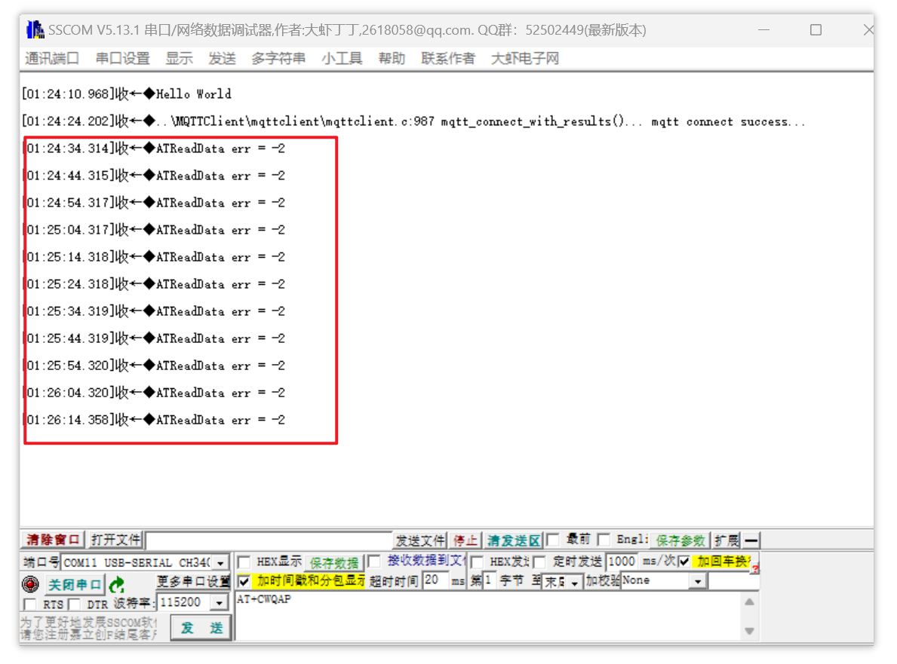
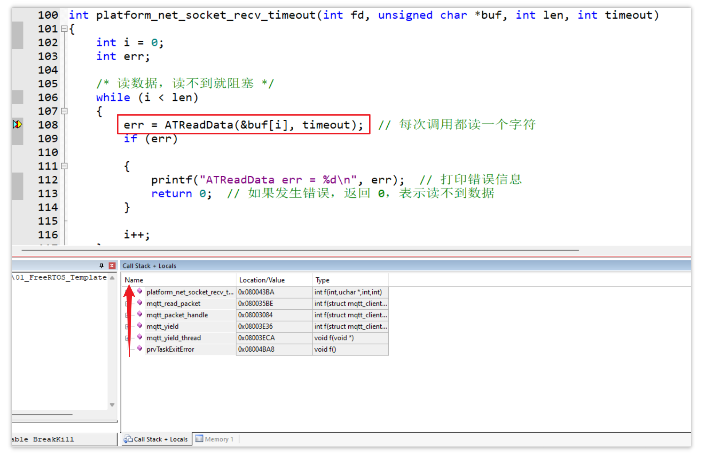
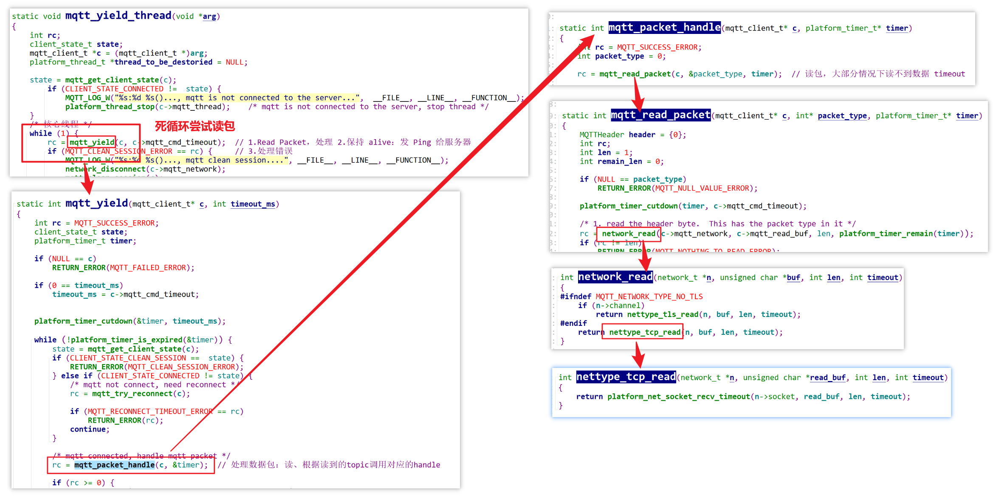
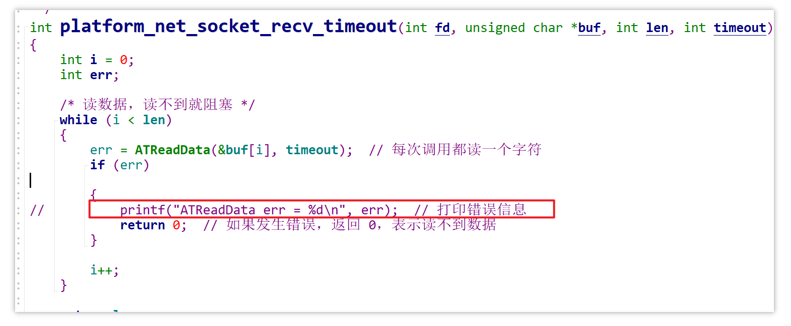
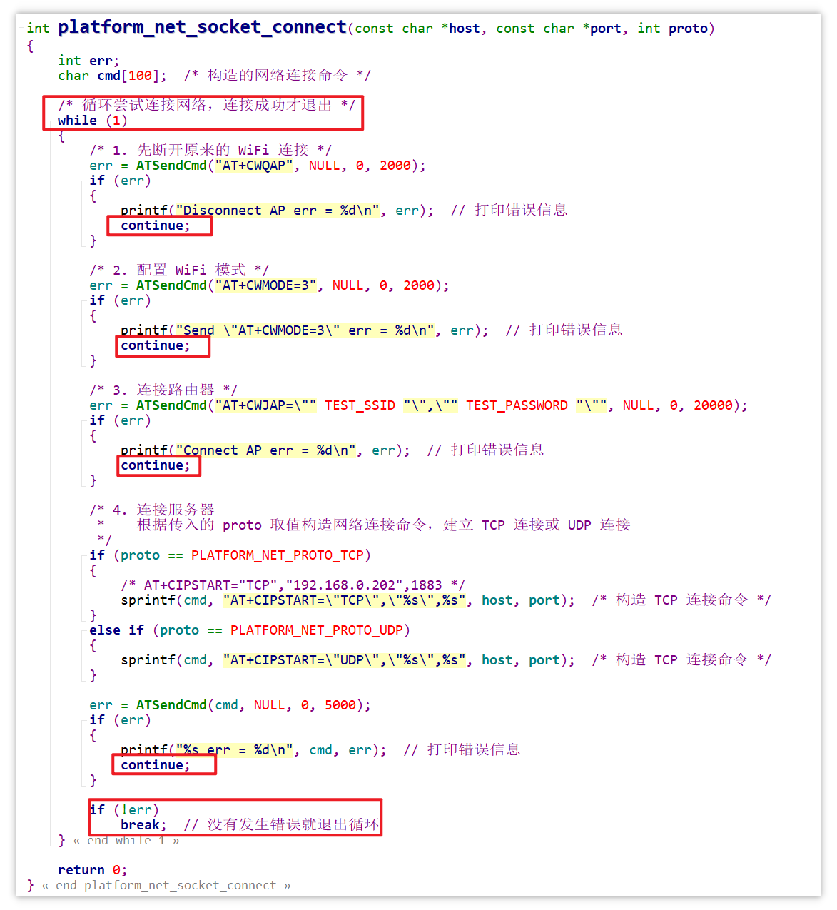
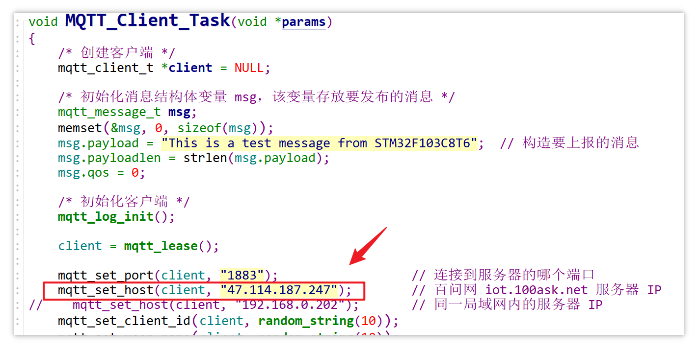
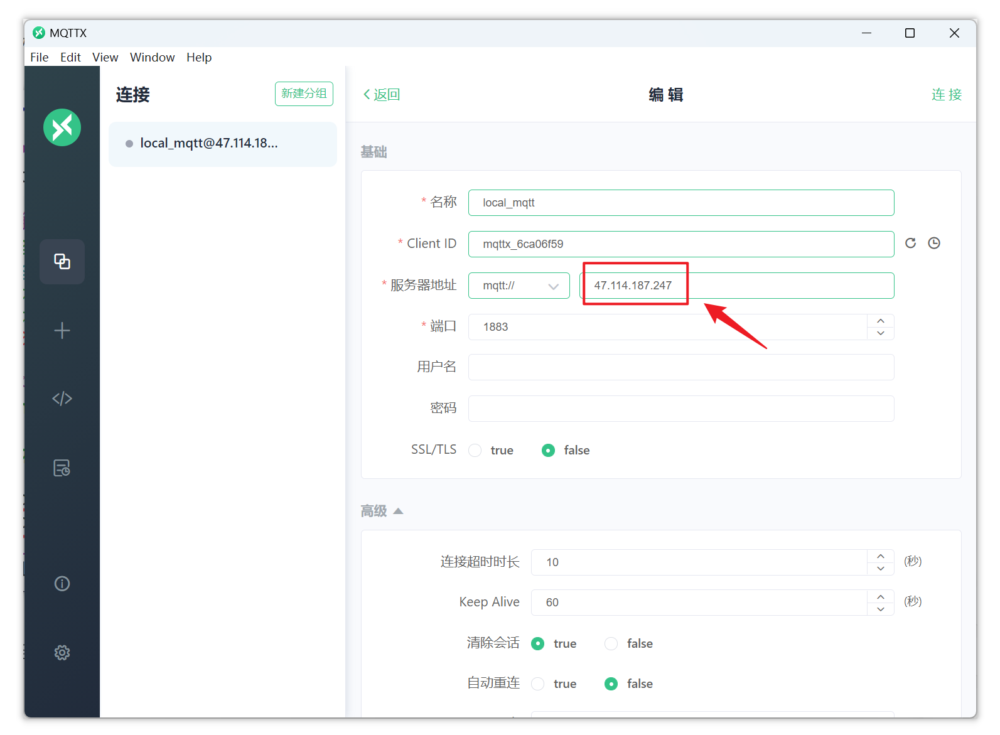
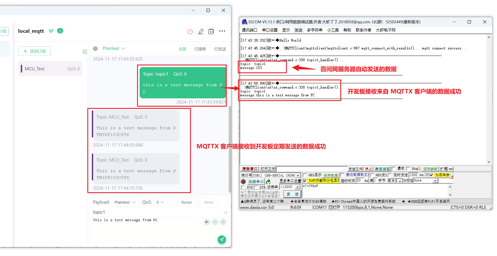

# 小 Bug

全速运行程序时（没有断点），发现当 `mqtt_yield_thread` 线程已经运行起来并且 `MQTT_Client_Task` 线程能够与服务器正常通信时，串口每隔十秒左右打印一次如下错误信息，表示读包错误：



保持全速运行，在读包函数前添加断点，追踪到如下函数调用关系：



根据调用关系追踪函数，发现是由于 `mqtt_yield_thread` 任务在循环地尝试读包，而大部分时间内是没有收到数据包的，所以就出现了读包超时并打印超时信息：



线程循环地检查是否有数据可读，是正常流程，删除掉读包超时的错误打印即可：




# 网络连接的改进

另外，希望程序在尝试连接网络的时候，不要错误返回，发生错误就重新尝试连接：




# 测试连接外部服务器

之前测试所用的服务器是与 ESP8266 连接到同一局域网内的，接下来用百问网 mqtt 服务器测试：

```shell
47.114.187.247         // iot.100ask.net
```

更改测试线程的服务器 IP 为百问网 MQTT 服务器 IP：



打开串口工具，准备查看调试信息。

重新编译工程，调速全速运行。

打开 MQTTX 客户端，也连接到百问网 MQTT 服务器：



测试成功：



==最终代码保存在 [16_MQTT_OK](assets/source/16_MQTT_OK) 目录下。==


# 后续

可扩展传感器等硬件模块，开发板根据接收到的主题消息解析数据，控制模块做出动作，如开关灯、电机控制。
